# Программа повышения квалификации «Веб-разработчик»

Преподаватель: Иван Жамойдо (@letitbecode)

Координатор:   Даниил (@iemit_dpo)

## Структура обучения 

📌Лекции — в онлайн-режиме с преподавателем в соответствии с расписанием

📌Практические занятия — в онлайн-режиме с преподавателем в соответствии с расписанием

📌Домашние задания — 3 задания в процессе обучения + дополнительные материалы для самостоятельного изучения

📌Итоговая аттестация — в формате тестирования: 30 вопросов 

## Сфера деятельности веб-разработчика

Основная цель вида профессиональной деятельности:
Создание, модификация и сопровождение web-сайтов, корпоративных порталов организаций, мультимедиа и интерактивных приложений, информационных ресурсов

Веб-разработчик создаёт сайты и веб-приложения. Его основная задача — разрабатывать, поддерживать и развивать клиентскую часть web-страниц — то, что видят пользователи, и серверную — ту, которая доступна только разработчикам. Web-разработчики используют различные языки программирования, например JavaScript, PHP, Python и Ruby, для создания, доработки сайтов и баз данных для хранения информации. Они также занимаются настройкой сервера и оптимизацией сайта. Другими словами, отвечает за функциональность сайта.

*Веб-разработчик* — это специалист, который создаёт и поддерживает веб-сайты и веб-приложения. Он пишет код, который позволяет сайту не просто красиво выглядеть, а работать.

## Что такое веб-приложение?

### Основные компоненты:
- **Клиент (frontend)**: браузер пользователя (например, Chrome, Firefox).
- **Сервер (backend)**: машина, отвечающая на HTTP-запросы.
- **Протокол**: HTTP(S) — основа взаимодействия.

## Основные направления в веб-разработке

Веб-разработка делится на три ключевые области: 


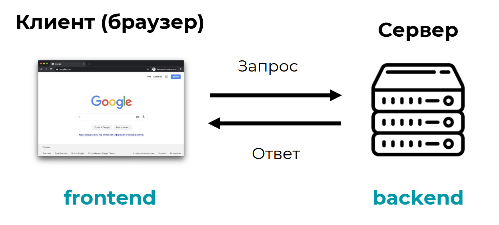

1. **Frontend** (фронтенд) — «лицо» сайта 

Фронтенд — это всё, что видит пользователь: интерфейс, анимации, кнопки, меню, слайдеры. Занимается клиентской частью сайта — той, которую пользователь видит в браузере. С помощью кода он реализует идею, которую дизайнер заложил в макете. Например, может разработать функцию корзины в интернет-магазине.


Что делает фронтенд-разработчик: 

- Верстает макеты дизайна в код (HTML, CSS).
- Добавляет интерактивность с помощью JavaScript.
- Обеспечивает адаптивность под разные устройства (телефоны, планшеты, ПК).
- Работает с фреймворками: React, Vue, Angular.


2. **Backend** (бэкенд) — «мозг» сайта 

Бэкенд — это серверная часть, которая работает "за кулисами". Он обрабатывает данные, общается с базами данных, проверяет логины и пароли, отправляет письма. Создает серверную часть сайта и работает с базами данных и функциями для обработки информации на сервере. Может отвечать за авторизацию, обработку платежей, работу с почтовыми уведомлениями. Например, для интернет-магазина может создать административную панель для управления ассортиментом товаров в каталоге.

Что делает бэкенд-разработчик: 

- Пишет логику сервера (на Python, PHP, Ruby, Java, Node.js и др.).
- Работает с базами данных (MySQL, PostgreSQL, MongoDB).
- Создаёт API (интерфейсы взаимодействия между фронтендом и сервером).
- Обеспечивает безопасность и масштабируемость.
     
Пример: когда вы вводите логин и пароль — бэкенд проверяет их в базе данных и даёт доступ. 
     
3. **Fullstack** — разработчик «от и до» 

Fullstack-разработчик умеет работать и с фронтендом, и с бэкендом. Он может создать полноценный сайт с нуля — от интерфейса до серверной логики. 

Это как универсальный строитель, который может и стены построить, и проводку провести. 

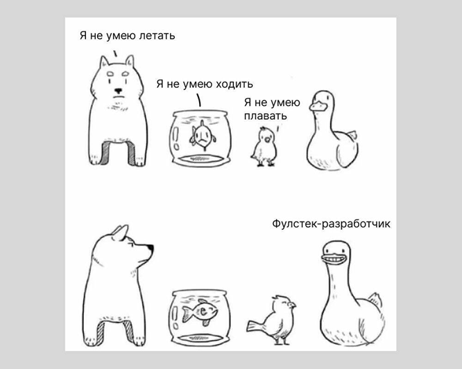

## Что нужно знать, чтобы стать веб-разработчиком?

1. Frontend: HTML + CSS + JS (TS). Известные фреймворки React / Vue / Angular, сборщики (Webpack, Vite)

2. Backend: Python (Django/Flask), Node.js,  PHP (Laravel), базы данных (SQL и NOSQL), проектирование архитектуры веб-приложений.

3. fullstack: комбинации перечисленного 


Людям нужны быстрые, удобные и красивые сайты. По данным Google, пользователь закроет мобильную версию сайта, если она загружается дольше трёх секунд, и продолжит пользоваться сайтом или приложением, если они удобные. Веб-разработчики могут создавать такие сервисы, если будут использовать подходящие языки, фреймворки, библиотеки и технологии. Вот восемь из них:

1. JavaScript — язык программирования, который разработчики используют для создания интерактивных элементов на веб-страницах. Например, галереи фотографий, которые можно листать, выпадающие меню или кнопки, которые меняют внешний вид при наведении курсора. Это единственный язык программирования для фронтенда, поэтому он очень популярный ― для запуска программ в браузере нет альтернативы. 

2. HTML / CSS — две связанные технологии, которые используют для определения структуры и стиля веб-страниц. Например, HTML может определить, где на странице разместить текст, картинки и другие элементы, а CSS добавляет визуальные элементы — цвет и шрифты.

3. React, Angular и Vue.js — фреймворки JavaScript, которые разработчики используют для создания пользовательских интерфейсов. Фреймворк – это готовый код для решения типовых задач. Например, задать маршрут для данных от сайта к серверу, обновить их или сохранить, если пользователь переходит в другой раздел сайта или приложения. Пользователь не видит все эти процессы, но разработчик должен их запрограммировать, чтобы приложение работало, как задумано. Если писать код для таких задач на обычном JavaScript, это займёт много времени и можно допустить в нём ошибки. Во фреймворке прописаны правила и ограничения для кода, поэтому он получается более однообразным, предсказуемым и с меньшим количеством ошибок. Так писать приложения получается быстрее — разработчик фокусируется на сути продукта, а не технических деталях. 

4. TypeScript — это расширение JavaScript. С ним код более надёжный и читабельный. 

5. Node.js — это среда выполнения JavaScript, которая позволяет разработчикам создавать серверные приложения на этом языке. Например, можно разработать сервер электронной почты, чтобы отправлять и получать сообщения. Другой пример бэкенда на Node.js — социальная сеть, где пользователи могут заполнить профиль и запостить фото с подписью.

6. Python — язык программирования, который поддерживает многопоточность и может выполнять одновременно несколько задач. С этой функцией веб-приложение можно усложнять и не бояться, что оно будет зависать. У Python много библиотек и фреймворков, которые помогают быстрее и проще писать код.

7. PostgreSQL — одна из лучших реляционных SQL баз данных. Её используют для хранения, организации и управления большими объёмами структурированных данных. Такую базу может внедрить онлайн-магазин — чтобы хранить данные о клиентах, заказах, товарах и складах. 

8. MongoDB — одна из популярных нереляционных No-SQL баз данных, часто используется в стеке с Node.js на бэкенде.


* список не является исчерпывающим

### Другие интернет-протоколы:
| Протокол | Назначение |
|---------|-----------|
| **FTP** | Передача файлов |
| **SMTP** | Отправка электронной почты |
| **IMAP/POP3** | Получение почты |
| **DNS** | Преобразование доменных имён в IP-адреса |
| **WebSocket** | Двунаправленная связь в реальном времени (используется в чатах, онлайн-играх) |
| **gRPC** | Вызов удалённых процедур (RPC), работает поверх HTTP/2, эффективен для микросервисов |
| **MQTT** | Лёгкий протокол для IoT-устройств |

> **HTTP** стал доминирующим благодаря простоте, универсальности и интеграции с браузерами.

## Протокол HTTP — основа веба

**HTTP (HyperText Transfer Protocol)** — это прикладной протокол, используемый для передачи данных в вебе. Именно он позволяет браузеру и серверу "договариваться" о том, что запрашивать, как отвечать и что делать дальше.

### Основные характеристики HTTP:
- **Текстовый** — сообщения легко читать (в отличие от бинарных протоколов).
- **Без состояния (stateless)** — каждый запрос независим. Сервер не "помнит" предыдущие запросы.
- **Клиент-серверный** — клиент отправляет запрос, сервер возвращает ответ.
- **Работает поверх TCP/IP** — обеспечивает надёжную доставку пакетов.

### Как работает HTTP?

#### 1. Клиент отправляет **запрос (Request)**:
```
GET /index.html HTTP/1.1
Host: example.com
User-Agent: Chrome/120
Accept: text/html
```

#### 2. Сервер возвращает **ответ (Response)**:
```
HTTP/1.1 200 OK
Content-Type: text/html
Content-Length: 137 
<html>
  <body>
    <h1>Hello, World!</h1>
  </body>
</html>
```

### Основные методы

GET
Получить данные (например, страницу)

POST
Отправить данные (например, форму)

PUT
Обновить ресурс полностью

DELETE
Удалить ресурс

### Коды состояний

Коды состояния (HTTP Status Codes): 

2xx
Успех

3xx
Перенаправление
	

4xx
Ошибка клиента
	
5xx
Ошибка сервера


## История развития веб-разработки

Веб-разработка началась в 1990-х годах с появления интернета. Позже эти первые 10 лет развития сети назовут эпохой web 1.0. Сначала сайты были простыми HTML-страницами и по функциям напоминали библиотеку — посетители заходили, читали, но никак с ними не взаимодействовали. Публиковать контент было сложно — требовались технические навыки, которые были доступны в основном учёным и программистам. 

Сам HTML разработали для нужд CERN — Европейской организации по ядерным исследованиям, чтобы обмениваться научными документами. Но тогда никто из учёных не мог представить, насколько далеко зайдёт эта разработка.

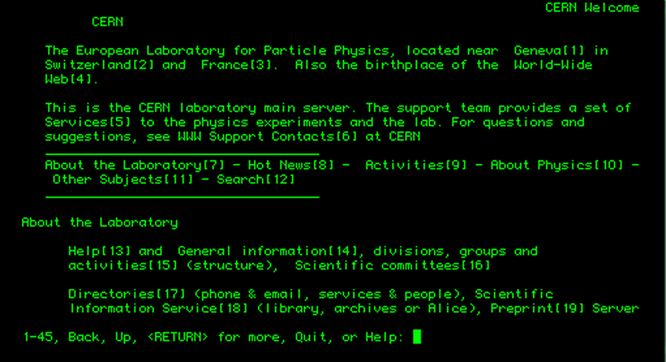

Первый веб-сайт в 1991 году выглядел примерно так. Его разработал британский физик Тим Бёрнерс-Ли. Сайт был посвящен технологии World Wide Web и содержал базовую информацию о проекте: как он устроен и что нужно для работы с веб-сайтами. Источник: CERN

В 1999 году началась новая эпоха — web 2.0. Она отличалась от web 1.0 тем, что обычные пользователи могли создавать и модерировать контент. Появились первые соцсети — Facebook* и MySpace. В России до появления «ВКонтакте» популярной платформой для общения был «Живой журнал». Аккаунт мог завести любой пользователь с доступом в интернет — чтобы писать самому или читать и комментировать посты других авторов.

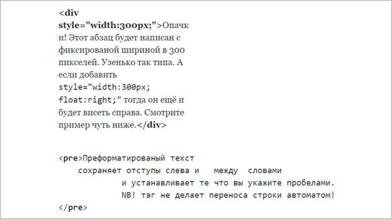

> Чтобы опубликовать в ЖЖ пост в начале 2000-х, нужно было немного разбираться в HTML-вёрстке. Блогеры периодически выкладывали инструкции: как выделить текст жирным, выровнять по центру, добавить отступы

В эпоху раннего веба сайтами занимался веб-мастер. Он мог немного писать код, делать простой дизайн и кое-что понимал в HTML, базах данных и протоколах передачи данных TCP/IP.

С развитием технологий эта профессия исчезла. Появились другие специалисты — разработчики, IT-архитекторы, UX/UI-дизайнеры, аналитики, менеджеры продуктов. Сайты и веб-приложения стали сложнее и эстетически более привлекательными. За них теперь отвечают отдельные специалисты — web-разработчики.

## Как работает интернет?

Интернет работает как глобальная сеть взаимосвязанных компьютеров, использующая протоколы (например, TCP/IP) для передачи данных в виде пакетов по физической инфраструктуре (кабелям, беспроводным сетям) через маршрутизаторы и провайдеров. Когда вы отправляете запрос, он разбивается на пакеты, которые направляются по кратчайшим путям к серверу, обрабатываются им, и ответные пакеты возвращаются к вам, собираясь в понятную информацию (например, веб-страницу) вашим устройством

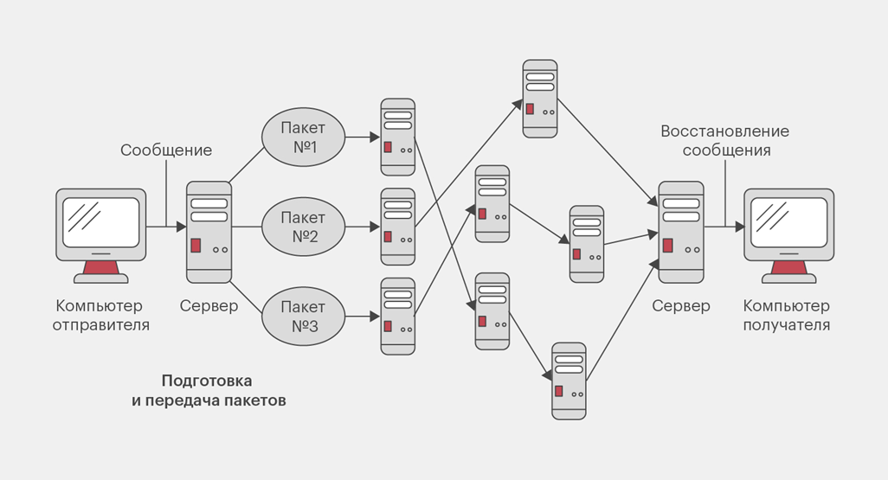


### Принципы работы технологии интернет

1. Множество компьютеров соединены друг с другом кабелями, радиоканалами, спутниковыми каналами и т.д.
2. Согласованность взаимодействия ЭВМ достигается путем создания соглашений (протоколов).

### Семейтво протоколов TCP\IP 

1. Корректная доставка данных до места назначения;
2. Передаваемая информация представлена в виде потока;
3. Выбирается оптимальный путь распространения сигнала между передающей и принимающей стороной.
4. При передаче данные разбиваются на фрагменты (пакеты)


### Что такое IP-адрес

IP-адрес (Internet Protocol Address) — это уникальный числовой идентификатор, присваиваемый каждому устройству, подключенному к сети, например, к Интернету или локальной сети. Он подобен почтовому адресу, но для данных: он позволяет компьютерам и другим устройствам находить друг друга и обмениваться информацией в виде пакетов данных, следуя определенным правилам (протоколу)

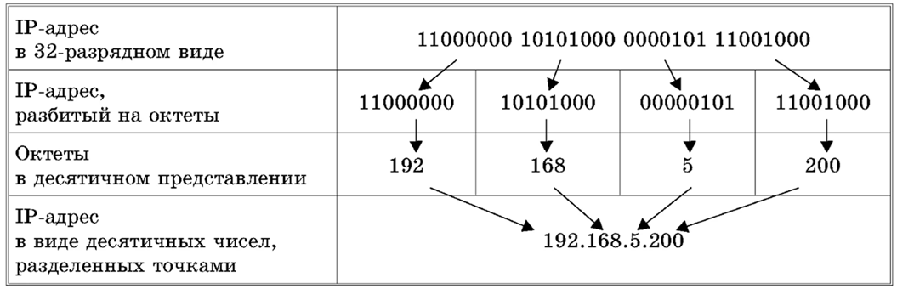

### что такое доменное имя сайта

Доменное имя сайта — это его легко запоминающееся название или адрес в интернете, например, google.com или wikipedia.org. Оно служит для того, чтобы пользователи могли найти веб-ресурс, вводя его в адресную строку браузера, вместо того чтобы запоминать сложный числовой IP-адрес сервера, на котором размещен сайт.

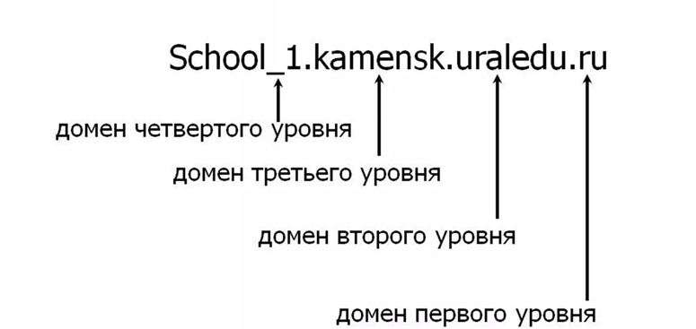


#### Структура доменного имени
Доменное имя состоит из нескольких частей, разделенных точками:

- Домен второго уровня (имя): Это основная, уникальная часть имени сайта, которую вы выбираете сами, например, skillfactory или yandex. 

- Домен верхнего уровня (доменная зона): Это последняя часть доменного имени, указывающая на принадлежность к определенной территории или типу ресурса, например, .ru, .com, .org. 

- Поддомены (при наличии): Это дополнительные части имени, которые могут разделять ресурс на независимые блоки (например, news.yandex.ru)


#### Что такое URL-адрес

URL (Uniform Resource Locator) — это адрес любого ресурса в Интернете, будь то веб-страница, изображение или видео. Он работает как почтовый адрес для файлов и страниц в сети, позволяя браузеру найти и отобразить нужный контент. URL состоит из нескольких частей, включая протокол (например, https://), доменное имя (например, example.com), путь к файлу и другие параметры. 

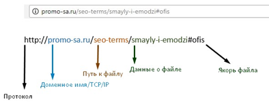

<br>

# Часть 2. Базовый HTML
## Язык разметки HTML

### Основные понятия

Язык текстовой разметки, в которую добавляются элементы форматирования.
Расширение файла: html, xhtml, htm

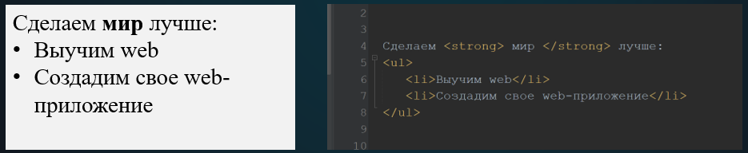

Основная сущность – **тег**

**Виды тегов**:
- парный (`<div> </div>`)
- одиночный `<hr>`

Теги являются регистронезависимыми

### Справочник по языку разметки HTML

В справочнике HTML перечислены все существующие HTML-тэги и их атрибуты, но далеко не все из них нужно знать. Знать нужно лишь основные

Справочник по языку HTML — https://webref.ru/html


### Структура HTML-страницы

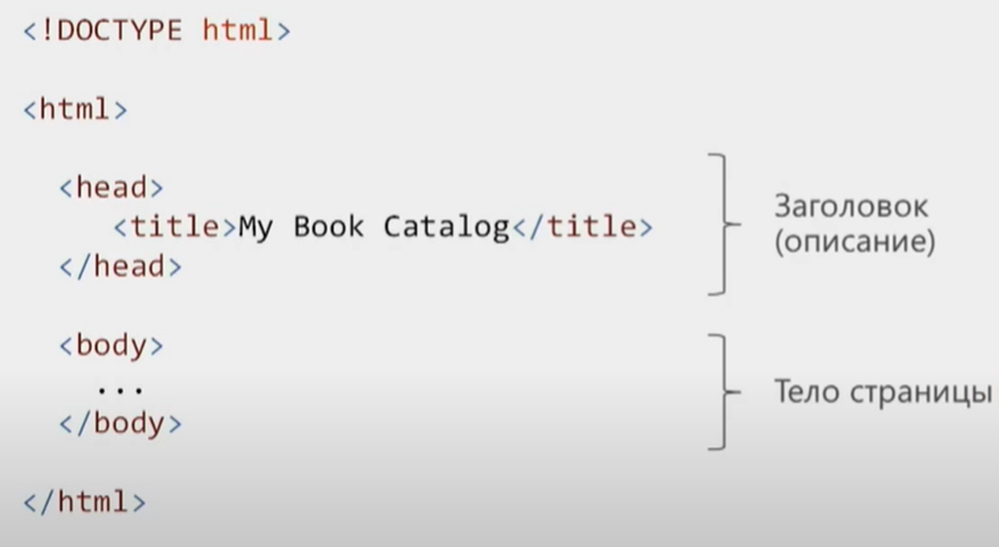


### HTML-теги

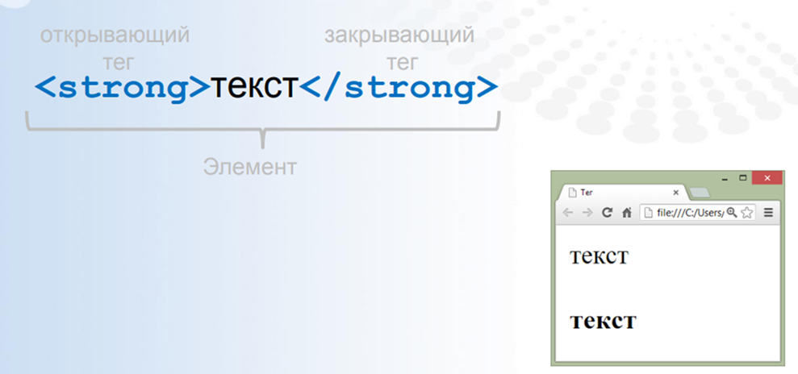

### HTML-теги. Атрибуты

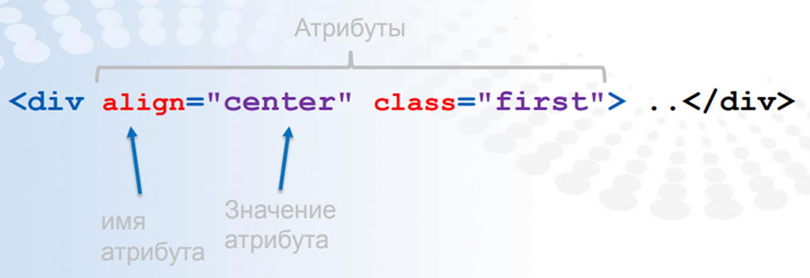

### Теги в контейнере `<head>`

Пишутся в “голове” документа — внутри тэга `<head>...</head>`
К ним относятся тэги установки стилей, подключения скриптов (на языке JavaScript), установки параметров веб-страницы

```HTML
<link>
<meta> 
<script>
<style>
<title>
<base>
<basefont>
<bgsound>
```

### Теги в контейнере `<body>`

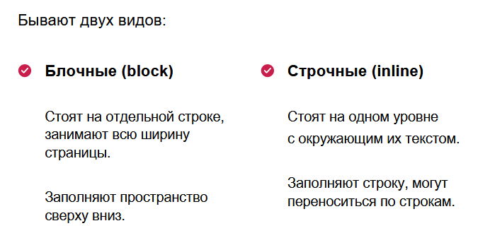

Блочные элементы занимают все пространство на всю допустимую ширину

Строчные элементы: 

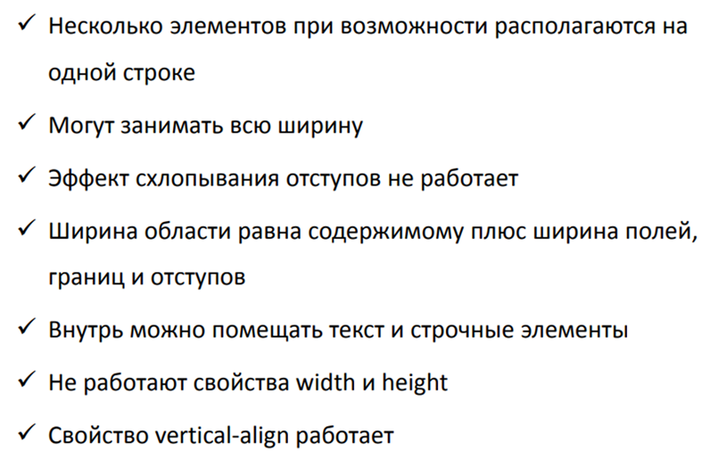

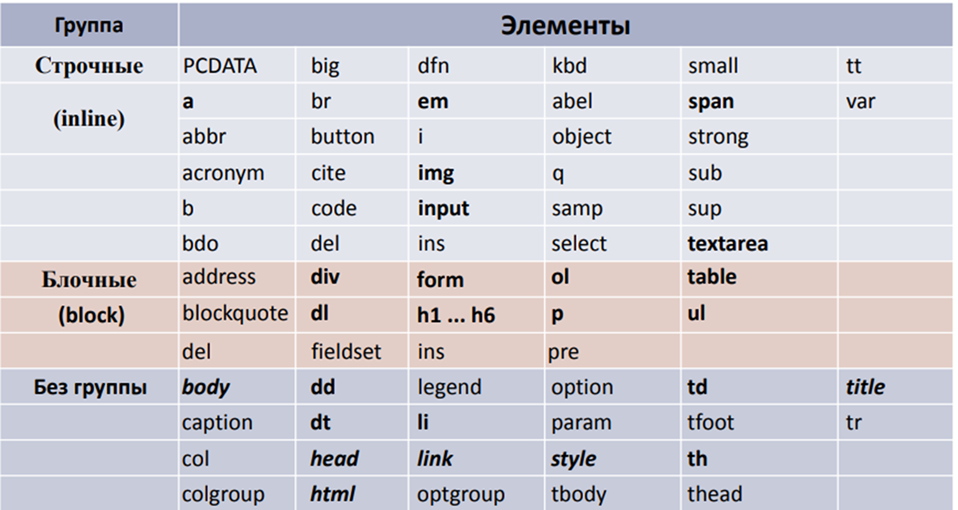

### Заголовки в HTML

Бывают шести видов (от самого крупного до самого мелкого):

```html
<h1>Самый большой</h1>
<h2>Второго уровня</h2>
<h3>Третьего уровня</h3>
<h4>Четвёртого уровня</h4>
<h5>Пятого уровня</h5>
<h6>Самый маленький</h6>
```

### Тег абзаца

```HTML
<p>Первый фрагмент некого
текста, который должен
отображаться как абзац</p>
<p>Второй фрагмент текста,
который станет вторым
абзацем на этой
странице</p>
```

### Списки

Взаимосвязанный набор отдельных фраз или предложений, которые начинаются с маркера или цифры

```<ol>  - устанавливает нумерованный список, т.е. каждый элемент списка начинается с числа или буквы и увеличивается по нарастающей.

<ul> - устанавливает маркированный список, каждый элемент которого начинается с небольшого символа — маркера.

<li> - определяет отдельный элемент списка в <ul> и <ol>.

<dd>, <dt>, <dl> - для терминов
```

Пример:

```html
<ul>
    <li>Молоко</li>
    <li>Масло</li>
    <li>Творог</li>
    <li>Сметана</li>
    <li>Хлеб</li>
</ul>

<ol>
    <li>Первое</li>
    <li>Второе</li>
    <li>Третье</li>
    <li>Компот</li>
</ol>
```

Плохая практика!

Так делать НЕльзя

```html 
<ul>
    <li><p>Молоко</p></li>
    <li>Масло</li>
    <li>Творог</li>
    <li>Сметана</li>
    <li>Хлеб</li>
    <div>Хлеб</div>
</ul>
```

### Тег `<span>`

Обычный текст. К нему можно применять отдельные стили

```html

<p>У дома стоял серый
автомобиль. Он был марки
<span>Mercedes</span>. И около
него нервно разговаривали три
человека. Они решали какой-то
очень важный для них всех
вопрос и никак не могли
договориться.</p>
```

### Теги форматирования

```html
<b>Жирный, от слова bold</b>
<i>Курсив, от слова italic</i>
<u>Подчёркнутый, underlined</u>
<s>Зачёркнутый, strikethrough</s>

<sup>Приподнятый текст</sup>
<sub>Опущенный текст</sub>

<small>Мелкий текст</small>
```

Для сохранения исходного форматирования текста — пробелов и переносов строк:

```html
<pre>Список вещей:
— куртка;
— кеды;
— зубная щётка.</pre>
```

### Комментарии в коде HTML

```html
<!-- Some description -->
<p>Некий текст</p>
```


### Атрибуты тегов

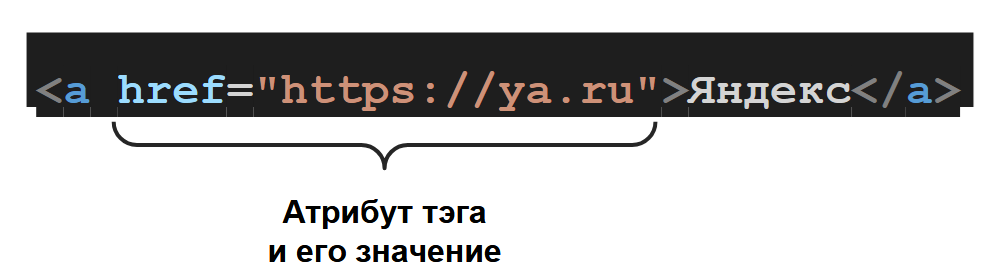


### Тег img и атрибут alt

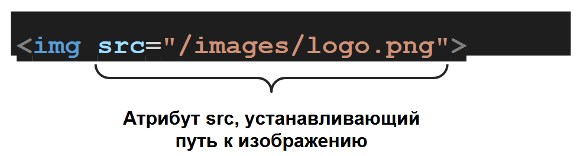

атрибут alt необходим для замены картинки, если она не подгрузилась, и для индексации поисковыми системами

```html

```

### Тег ссылки

```html
<a href="https://ya.ru">Яндекс</a>
```

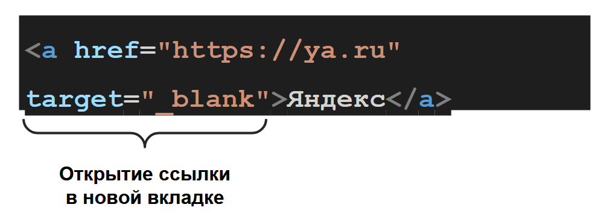


Тег ссылки, переход к блоку

```html
<a href="#contacts"
target="_blank">Контакты</a>
<div id="contacts">
Контакты...
</div>
```


Тег ссылки, скачивание файлов

```html
<a href="/files/resctrictions.pdf"
download="Ограничения.pdf">Скачать
</a>
```

### тег кнопки

```html
<button>Найти</button>
```

### Вложенные теги

```html
<p>Одна упаковка данного препарата
стоит не более <b>450 рублей</b>,
что вполне приемлемо для этой
категории лекарств.</p>
```

В этом тексте фрагмент “450 рублей” будет
отображаться жирным шрифтом

#### Ограничения

1. Нельзя вкладывать блочные в строчные

```html
<span><p>Одна упаковка данного
препарата</p> стоит не более
</span>
```

2. Нельзя вкладывать ничего лишнего в списки

```html
<ul>
<li>Молоко</li>
<li>Масло</li>
<li>Творог</li>
<li>Сметана</li>
<li>Хлеб</li>
<div>Хлеб</div>
</ul>
```


### Теги таблиц

```html
<table>
    <thead>
    </thead>
    <tbody>
    </tbody>
    <tfoot>
    </tfoot>
</table>
```

```
<caption>Таблица</caption>
```

#### Строки и столбцы таблицы

```html
<table>
<tr>
<td>1</td>
<td>Иван</td>
</tr>
<tr>
<td>2</td>
<td>Анна</td>
</tr>
</table>
```

#### Объединение ячеек таблиц

```html
<td colspan="2">ячейка</td>

<td rowspan="2">текст</td>

```

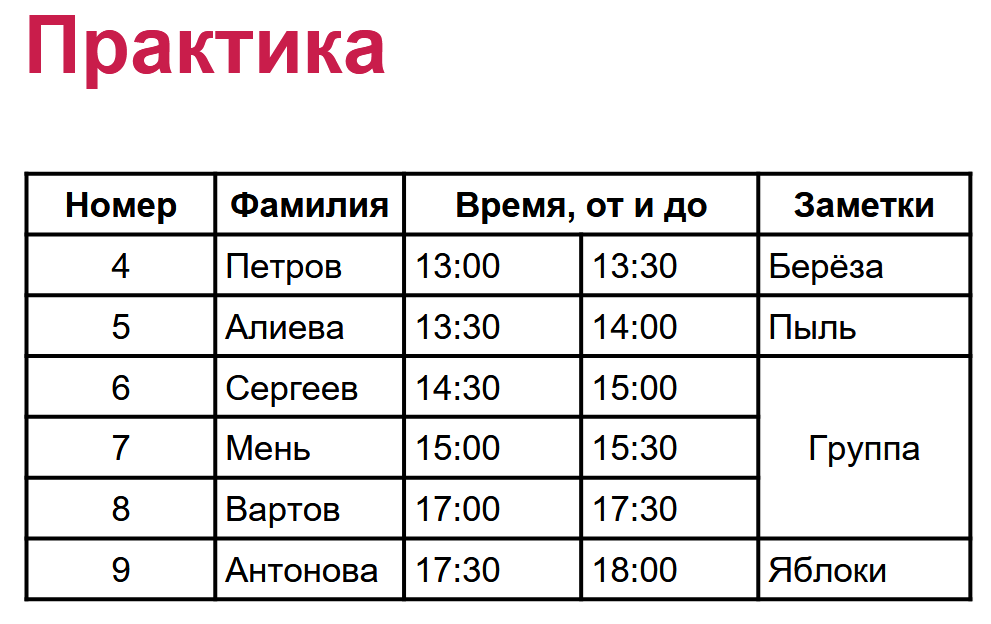


### Проверка валидости верстки

https://codeguide.maxgraph.ru/

### Базовый синтаксис 

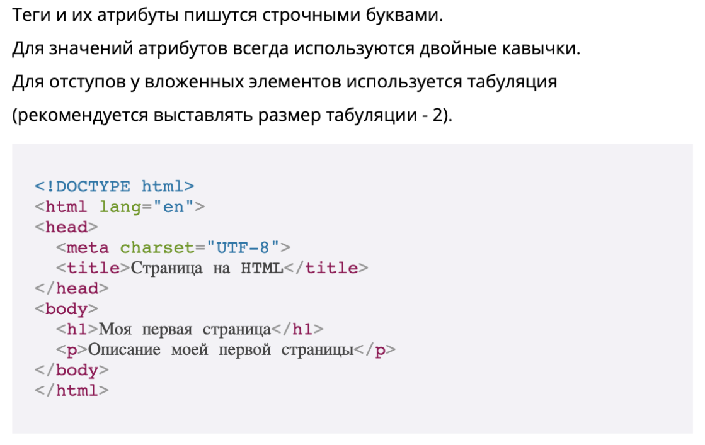

### Закрывающие теги


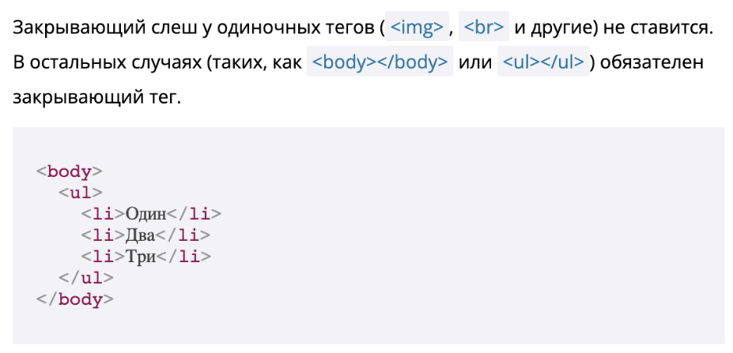

### Атрибут языка 

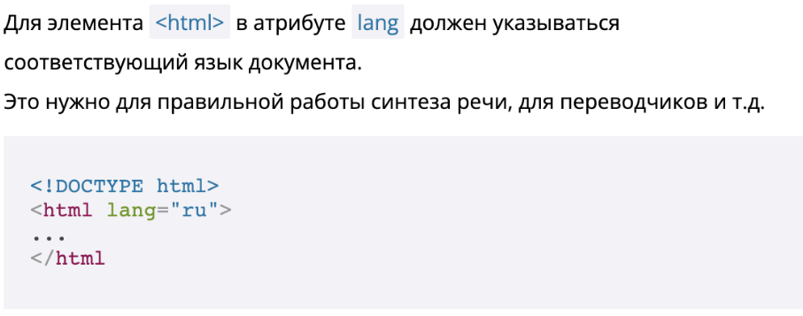

https://validator.w3.org/