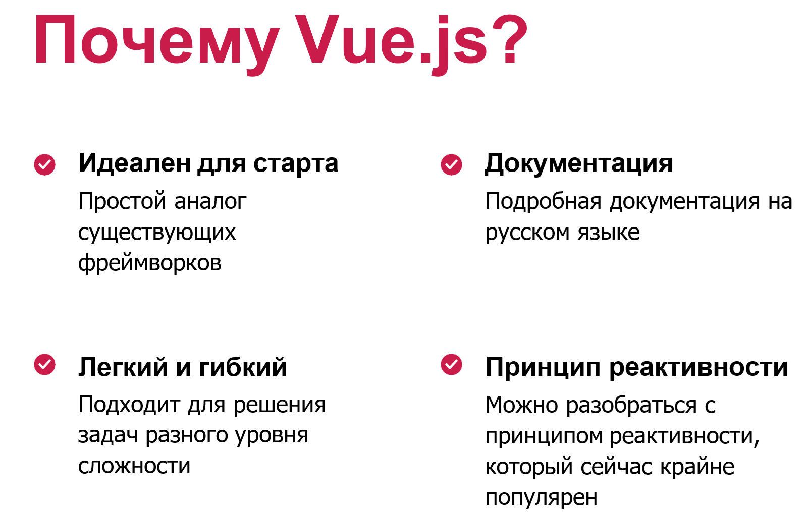

# Основы Vue JS

Фреймворк - готовая программная структура или набор иснтрументов и правил по которому следуют разработчики

React и VueJS - самые популярные фреймворки 





## Установка VueJS

1. Установить NodeJS !(https://nodejs.org/en/download)
2. Убедиться, что в командной строке доступны команды `node -v` `npm -v`
3. Создать проект с помощью команды `npm create vue@latest`
4. Скачать рекомендованное расширение VS-code (Vue Offical)
5. Перейти в папку с установившимся проектом (`cd project_name`)
6. Установить зависимости `npm install`
7. Запустить стартовое приложение в режиме разработки `npm run dev` 

## Синтаксис шаблонов

Vue использует синтаксис шаблонов, основанный на HTML. Он позволяет декларативно связывать отрисованный DOM с данными экземпляра компонента. Все шаблоны Vue являются синтаксически валидным HTML, который могут распарсить все HTML-парсеры и браузеры, соответствующих спецификации.

Под капотом Vue компилирует шаблоны в хорошо оптимизированный код JavaScript. В сочетании с системой реактивности Vue может определять минимальное число компонентов для перерисовки и при изменениях состояния приложения выполняет минимальное количество манипуляций с DOM.

1. Интерполяция
```js
<template>
  <div>
    <h1>Привет, {{ name }}!</h1>
    <p>Тебе {{ age }} лет.</p>
  </div>
</template>

<script>
export default {
  data() {
    return {
      name: 'Анна',
      age: 25
    }
  }
}
</script>
```