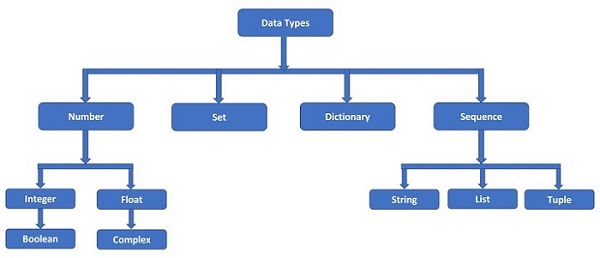

# 🐍 Характеристика языка Python 
 
## 🧠 Философия и концептуальные основы Python 

Python — это не просто язык программирования. Это философия, выраженная в коде. Автор языка, Гвидо ван Россум, с самого начала стремился создать инструмент, который был бы: 

- Простым для чтения
- Простым для написания
- Универсальным
- Дружелюбным к новичкам
     
Эти принципы зафиксированы в знаменитом документе — The Zen of Python («Дзен Python»), который можно вызвать прямо в интерпретаторе: 
python
 
 
```python
import this
```
 
Вывод: 
```
    The Zen of Python, by Tim Peters
    Beautiful is better than ugly.
    Explicit is better than implicit.
    Simple is better than complex.
    Complex is better than complicated.
    Flat is better than nested.
    Sparse is better than dense.
    Readability counts.
    Special cases aren't special enough to break the rules.
    Although practicality beats purity.
    Errors should never pass silently.
    Unless explicitly silenced.
    In the face of ambiguity, refuse the temptation to guess.
    There should be one-- and preferably only one --obvious way to do it.
    Although that way may not be obvious at first unless you're Dutch.
    Now is better than never.
    Although never is often better than right now.
    If the implementation is hard to explain, it's a bad idea.
    If the implementation is easy to explain, it may be a good idea.
    Namespaces are one honking great idea -- let's do more of those!

```  
```
    Красивое лучше, чем уродливое.
    Явное лучше, чем неявное.
    Простое лучше, чем сложное.
    Сложное лучше, чем запутанное.
    Плоское лучше, чем вложенное.
    Разреженное лучше, чем плотное.
    Читаемость имеет значение.
    Особые случаи не настолько особые, чтобы нарушать правила.
    При этом практичность важнее безупречности.
    Ошибки никогда не должны замалчиваться.
    Если они не замалчиваются явно.
    Встретив двусмысленность, отбрось искушение угадать.
    Должен существовать один и, желательно, только один очевидный способ сделать это.
    Хотя он поначалу может быть и не очевиден, если вы не голландец.
    Сейчас лучше, чем никогда.
    Хотя никогда зачастую лучше, чем прямо сейчас.
    Если реализацию сложно объяснить — идея плоха.
    Если реализацию легко объяснить — идея, возможно, хороша.
    Пространства имён — отличная штука! Будем делать их больше!
```

Эти строки — не просто поэзия. Это руководящие принципы разработки на Python, которые влияют на стиль кода, выбор библиотек, архитектуру приложений и даже культуру сообщества. 
 
📜 История Python

В конце 1980-х Гвидо ван Россум работал в голландском институте CWI над проектом операционной системы Amoeba. Ему требовался язык сценариев, который был бы мощнее, чем ABC (язык, на котором он ранее работал), но проще, чем C или Perl. 

Он начал разработку нового языка в декабре 1989 года — частично как хобби, частично как инструмент для своих задач. Первый релиз (версия 0.9.0) вышел в феврале 1991 года и уже содержал: 

```
    Классы
    Обработка исключений
    Функции
    Типы данных: list, dict, str, int
```

🐍 Почему “Python”? 

Название не имеет отношения к змеям — оно вдохновлено “Летающим цирком Монти Пайтона” — любимым комедийным шоу Гвидо. Он хотел, чтобы название было коротким, уникальным и немного загадочным. 


 
### 🚫 Конец эпохи Python 2 

1 января 2020 года официально прекращена поддержка Python 2. Это означает: 

- Нет обновлений безопасности
- Новые библиотеки не поддерживают Python 2
- Сообщество полностью перешло на Python 3
    
📌 Рекомендация: Всегда используйте Python 3.10+ (LTS) для новых проектов. 
     
## 🌍 Python в современном мире

Python — язык общего назначения, но особенно силён в следующих областях: 

### 🖥️ 1. Веб-разработка 

Python доминирует в backend-разработке благодаря зрелым фреймворкам: 

- `Django` — “batteries included”. Всё в комплекте: ORM, админка, аутентификация, маршрутизация. Подходит для крупных проектов.
- `Flask` — микрофреймворк. Минимализм и гибкость. Отлично подходит для API и небольших сервисов.
- `FastAPI` — современный фреймворк для асинхронных API с автоматической генерацией OpenAPI/Swagger-документации.
- `Sanic`, `Tornado` — для высоконагруженных асинхронных приложений.
     

Примеры известных сайтов на Python: 

- Instagram (Django)
- Pinterest (Django)
- Spotify (бэкенд на Python)
- Dropbox (ранние версии почти полностью на Python)
     

### 🤖 2. Data Science, Machine Learning, AI 

Python — де-факто стандарт в научных вычислениях и машинном обучении. 

Пример необходимых инструментов:

- NumPy — работа с многомерными массивами
- Pandas — анализ и манипуляция табличными данными
-  Matplotlib / Seaborn / Plotly — визуализация
-  Scikit-learn — классические ML-алгоритмы
-  TensorFlow / PyTorch — глубокое обучение
- Jupyter Notebook — интерактивная среда для экспериментов
     

### 🧰 3. Автоматизация и DevOps 

Python — язык выбора для написания скриптов: 

- Автоматизация тестирования (Selenium, Pytest)
- Управление инфраструктурой (Ansible — написан на Python!)
- CI/CD пайплайны
- Парсинг логов, файлов, данных
     

### 🕸️ 4. Веб-скрапинг и парсинг 

- BeautifulSoup — разбор HTML/XML
- Scrapy — полноценный фреймворк для краулинга
- Selenium — управление браузером (для динамических сайтов)
    

### 🎮 5. Игры и GUI 

- Pygame — 2D-игры
- Tkinter — встроенная библиотека для создания оконных приложений
- PyQt / Kivy — продвинутые GUI и кроссплатформенные мобильные приложения
        

## 📈 Эволюция версий 


| Версия  | Год     | Основные изменения                                                                 |
|----------|---------|------------------------------------------------------------------------------------|
| 0.9.0    | 1991    | Первый релиз                                                                       |
| 1.0      | 1994    | `lambda`, `map`, `filter`, `reduce`                                                |
| 2.0      | 2000    | Списковые включения, сборщик мусора, Unicode (частично)                             |
| 3.0      | 2008    | Ломающее обновление: Unicode по умолчанию, `print()` как функция, деление `5/2 → 2.5`, удалены устаревшие конструкции |
| 3.3+     | 2012–н.в. | Виртуальные окружения встроены, `async/await`, pattern matching (3.10), улучшения производительности |

 
 
## ⚙️ Установка Python:

### 💻 Windows 

1. Перейдите на python.org/downloads 
2. Скачайте последнюю версию (например, Python 3.12.x)
3. Запустите .exe-файл
4. Обязательно поставьте галочку: ✅ “Add Python to PATH”
5. Выберите “Customize installation” → включите все компоненты, включая pip, py launcher, documentation
6. Установите для всех пользователей (если есть права администратора)
     

### 🐧 Linux (Ubuntu/Debian) 

Python 3 часто предустановлен. Проверьте: 
```bash
python3 --version
```
 

Если не установлен: 
```bash
sudo apt update
sudo apt install python3 python3-pip python3-venv
``` 

### 🍎 macOS 


Скачайте с python.org → установите → добавьте в PATH: 

```bash
echo 'export PATH="/usr/local/bin:$PATH"' >> ~/.zshrc  # для zsh
source ~/.zshrc
```
 
Способ 2: Homebrew (рекомендуется) 


```bash 
/bin/bash -c "$(curl -fsSL https://raw.githubusercontent.com/Homebrew/install/HEAD/install.sh)"
brew install python3
``` 
 

Проверка: 

```bash
python3 --version
pip3 --version
```
 
 
## 📦 Пакетный менеджер pip. Архитектура экосистемы пакетов Python 
🧩 Что такое pip? 

`pip` — рекурсивный акроним: "pip installs packages". Это менеджер пакетов, который позволяет устанавливать, обновлять и удалять сторонние библиотеки из PyPI (Python Package Index)  — репозитория с более чем 500 000 пакетов. 

🏗️ Как работает pip? 

- Вы вводите `pip install имя_пакета`
- `pip` обращается к PyPI, ищет пакет
- Скачивает архив (обычно .whl или .tar.gz)
- Распаковывает и устанавливает в директорию site-packages
- Зависимости устанавливаются автоматически (если указаны в setup.py или pyproject.toml)
     

🔧 Основные команды pip: 
```bash
pip install requests                  # установить пакет
pip install requests==2.28.2          # установить конкретную версию
pip install -U requests               # обновить пакет
pip uninstall requests                # удалить
pip list                              # список установленных пакетов
pip show requests                     # информация о пакете
pip freeze > requirements.txt         # сохранить зависимости
pip install -r requirements.txt       # установить зависимости из файла
pip check                             # проверить конфликты зависимостей
```
 
## 🧪 Виртуальные окружения

Чтобы избежать конфликтов версий между проектами, используйте виртуальные окружения: 

```bash
python -m venv myenv        # создать окружение
source myenv/bin/activate   # Linux/macOS
myenv\Scripts\activate      # Windows
pip install django          # установка только в это окружение
deactivate                  # выход
``` 
 


# 🧮 Python - Типы данных

Python — язык с динамической и сильной типизацией. 

- Динамическая — тип переменной определяется во время выполнения, объявлять не нужно.
- Сильная — нельзя неявно складывать строку с числом (в отличие от JavaScript).
     
## Типы данных Python

Типы данных Python на самом деле являются классами, а определенные переменные - их экземплярами или объектами. Поскольку Python является динамически типизированным языком, тип данных переменной определяется во время выполнения на основе присвоенного значения.

В общем случае типы данных используются для определения типа переменной. Они представляют тип данных, который мы собираемся хранить в переменной, и определяют, какие операции можно выполнять с ними.

Каждый язык программирования имеет свою собственную классификацию элементов данных. С помощью этих типов данных мы можем хранить различные типы значений данных.


# Python - Переменные

## Переменные Python

Переменные Python — это зарезервированные области памяти, используемые для хранения значений в программе Python. Это означает, что при создании переменной вы резервируете некоторое пространство в памяти.

На основе типа данных переменной для неё выделяется память. Таким образом, присваивая переменным Python различные типы данных, вы можете хранить в этих переменных целые числа, десятичные числа или символы.

## Создание переменных Python

Переменным Python не требуется явное объявление для резервирования пространства памяти, или, другими словами, для создания переменной. Переменная Python создается автоматически, когда вы присваиваете ей значение. Знак равенства (=) используется для присваивания значений переменным.

Операнд слева от оператора = — это имя переменной, а операнд справа от оператора = — это значение, хранящееся в переменной. Например:

### Пример создания переменных Python

Этот пример создает переменные различных типов (целое число, число с плавающей запятой и строку).

```python
counter = 100          # Создает переменную целого числа
miles = 1000.0         # Создает переменную с плавающей запятой
name = "Зара Али"      # Создает переменную строки
```

## Вывод переменных Python

После создания переменной Python и присваивания ей значения мы можем вывести её с помощью функции print(). Следующее — это расширение предыдущего примера, показывающее, как выводить различные переменные в Python:

### Пример вывода переменных Python

Этот пример выводит переменные.

```python
counter = 100          # Создает переменную целого числа
miles = 1000.0         # Создает переменную с плавающей запятой
name = "Зара Али"      # Создает переменную строки

print(counter)
print(miles)
print(name)
```

Здесь 100, 1000.0 и "Зара Али" — это значения, присвоенные переменным counter, miles и name соответственно. При запуске приведенной выше программы Python это даст следующий результат:

```
100
1000.0
Зара Али
```

## Удаление переменных Python

Вы можете удалить ссылку на объект числа, используя оператор del. Синтаксис оператора del следующий:

```python
del var1[, var2[, var3[...., varN]]]]
```

Вы можете удалить один объект или несколько объектов с помощью оператора del. Например:

```python
del var
del var_a, var_b
```

### Пример

Следующие примеры показывают, как мы можем удалить переменную, и если мы попытаемся использовать удаленную переменную, интерпретатор Python выдаст ошибку:

```python
counter = 100
print(counter)

del counter
print(counter)
```

Это даст следующий результат:

```
100
Traceback (most recent call last):
  File "main.py", line 7, in <module>
    print(counter)
NameError: name 'counter' is not defined
```

## Получение типа переменной

Вы можете получить тип данных переменной Python с помощью встроенной функции Python type(), как показано ниже.

### Пример: Вывод типа переменных

```python
x = "Зара"
y = 10
z = 10.10

print(type(x))
print(type(y))
print(type(z))
```

Это даст следующий результат:

```
<class 'str'>
<class 'int'>
<class 'float'>
```

## Приведение типов переменных Python

Вы можете указать тип данных переменной с помощью приведения типов следующим образом:

### Пример

Этот пример демонстрирует чувствительность к регистру переменных.

```python
x = str(10)    # x будет '10'
y = int(10)    # y будет 10
z = float(10)  # z будет 10.0

print("x =", x)
print("y =", y)
print("z =", z)
```

Это даст следующий результат:

```
x = 10
y = 10
z = 10.0
```

## Чувствительность к регистру переменных Python

Переменные Python чувствительны к регистру, что означает, что Age и age — это две разные переменные:

```python
age = 20
Age = 30

print("age =", age)
print("Age =", Age)
```

Это даст следующий результат:

```
age = 20
Age = 30
```

## Переменные Python - Множественное присваивание

Python позволяет инициализировать более одной переменной в одном операторе. В следующем случае три переменные имеют одинаковое значение.

```python
>>> a = 10
>>> b = 10
>>> c = 10
```

Вместо отдельных присваиваний вы можете сделать это в одном операторе присваивания следующим образом:

```python
>>> a = b = c = 10
>>> print(a, b, c)
10 10 10
```

В следующем случае у нас есть три переменные с различными значениями.

```python
>>> a = 10
>>> b = 20
>>> c = 30
```

Эти отдельные операторы присваивания можно объединить в один. Вам нужно дать имена переменных, разделенные запятыми, слева, и значения, разделенные запятыми, справа от оператора =.

```python
>>> a, b, c = 10, 20, 30
>>> print(a, b, c)
10 20 30
```

Давайте попробуем несколько примеров в скриптовом режиме:

```python
a = b = c = 100

print(a)
print(b)
print(c)
```

Это даст следующий результат:

```
100
100
100
```

Здесь создается объект целого числа со значением 1, и все три переменные присваиваются к одному и тому же месту памяти. Вы также можете присвоить несколько объектов нескольким переменным. Например:

```python
a, b, c = 1, 2, "Зара Али"

print(a)
print(b)
print(c)
```

Это даст следующий результат:

```
1
2
Зара Али
```

Здесь два объекта целых чисел со значениями 1 и 2 присваиваются переменным a и b соответственно, а один объект строки со значением "Зара Али" присваивается переменной c.

## Переменные Python - Правила именования

Каждая переменная Python должна иметь уникальное имя, например, a, b, c. Имя переменной может быть осмысленным, например, color, age, name и т.д. Есть определенные правила, которые следует соблюдать при именовании переменной Python:

+ Имя переменной должно начинаться с буквы или символа подчеркивания
+ Имя переменной не может начинаться с числа или любого специального символа, такого как $, (, * % и т.д.
+ Имя переменной может содержать только буквенно-цифровые символы и подчеркивания (A-z, 0-9 и _)
+ Имена переменных Python чувствительны к регистру, что означает, что Name и NAME — это две разные переменные в Python.
+ Зарезервированные ключевые слова Python нельзя использовать для именования переменной.

Если имя переменной содержит несколько слов, мы должны использовать эти шаблоны именования:

* **Camel case** — Первая буква в нижнем регистре, но первая буква каждого последующего слова в верхнем регистре. Например: kmPerHour, pricePerLitre
* **Pascal case** — Первая буква каждого слова в верхнем регистре. Например: KmPerHour, PricePerLitre
* **Snake case** — Используйте одиночный символ подчеркивания (_) для разделения слов. Например: km_per_hour, price_per_litre

### Пример

Следующие имена переменных Python действительны:

```python
counter = 100
_count = 100
name1 = "Зара"
name2 = "Нуха"
Age = 20
zara_salary = 100000

print(counter)
print(_count)
print(name1)
print(name2)
print(Age)
print(zara_salary)
```

Это даст следующий результат:

```
100
100
Зара
Нуха
20
100000
```

### Пример

Следующие имена переменных Python недействительны:

```python
1counter = 100
$_count = 100
zara-salary = 100000

print(1counter)
print($count)
print(zara-salary)
```

Это даст следующий результат:

```
File "main.py", line 3
    1counter = 100
           ^
SyntaxError: invalid syntax
```

### Пример

После того как вы используете переменную для идентификации объекта данных, её можно использовать многократно без её значения id(). Здесь у нас есть переменные height и width прямоугольника. Мы можем вычислить площадь и периметр с помощью этих переменных.

```python
>>> width = 10
>>> height = 20
>>> area = width * height
>>> area
200
>>> perimeter = 2 * (width + height)
>>> perimeter
60
```

Использование переменных особенно выгодно при написании скриптов или программ. Следующий скрипт также использует вышеуказанные переменные.

```python
#!/usr/bin/python3

width = 10
height = 20
area = width * height
perimeter = 2 * (width + height)
print("Площадь =", area)
print("Периметр =", perimeter)
```

Сохраните приведенный выше скрипт с расширением .py и выполните из командной строки. Результат будет следующий:

```
Площадь = 200
Периметр = 60
```

## Локальные переменные Python

Локальные переменные Python определяются внутри функции. Мы не можем получить доступ к переменной за пределами функции.

Функция Python — это фрагмент повторно используемого кода, и вы узнаете больше о функциях в руководстве по функциям Python.

### Пример

Следующий пример показывает использование локальных переменных:

```python
def sum(x, y):
    sum = x + y
    return sum

print(sum(5, 10))
```

Это даст следующий результат:

```
15
```

## Глобальные переменные Python

Любая переменная, созданная вне функции, может быть доступна в любой функции, поэтому у неё глобальная область видимости.

### Пример

Следующий пример глобальных переменных:

```python
x = 5
y = 10

def sum():
    sum = x + y
    return sum

print(sum())
```

Это даст следующий результат:

```
15
```

## Константы в Python

В Python нет формально определенных констант, однако вы можете указать, что переменная должна рассматриваться как константа, используя имена в ВЕРХНЕМ РЕГИСТРЕ с подчеркиваниями. Например, имя PI_VALUE указывает, что вы не хотите, чтобы переменная переопределялась или изменялась каким-либо образом.

Конвенция именования с использованием ВЕРХНЕГО РЕГИСТРА иногда называется screaming snake case — где ВЕРХНИЙ РЕГИСТР (кричащий) и подчеркивания (змеи).

## Типы типов данных в Python

Python поддерживает следующие встроенные типы данных:



## 1. Числовые типы данных Python

Числовые типы данных Python хранят числовые значения. Объекты чисел создаются, когда вы присваиваете им значение. Например:

```python
var1 = 1       # тип данных int
var2 = True    # тип данных bool
var3 = 10.023  # тип данных float
var4 = 10+3j   # тип данных complex
```

Python поддерживает четыре различных числовых типа, и каждый из них имеет встроенные классы в библиотеке Python, называемые int, bool, float и complex соответственно:

- **int** (целые числа со знаком)
- **float** (вещественные значения с плавающей запятой)
- **complex** (комплексные числа)

Комплексное число состоит из двух частей - действительной и мнимой. Они разделены знаками '+' или '-'. Мнимая часть суффицируется 'j', что является мнимым числом. Квадратный корень из -1 (√-1) определен как мнимое число. Комплексное число в Python представлено как x+yj, где x - действительная часть, а y - мнимая часть. Таким образом, 5+6j - это комплексное число.

```python
>>> type(5+6j)
<class 'complex'>
```

Вот некоторые примеры чисел:

| int     | float        | complex       |
|---------|--------------|---------------|
| 10      | 0.0          | 3.14j         |
| 0O777   | 15.20        | 45.j          |
| -786    | -21.9        | 9.322e-36j    |
| 080     | 32.3+e18     | .876j         |
| 0x17    | -90.         | -.6545+0J     |
| -0x260  | -32.54e100   | 3e+26J        |
| 0x69    | 70.2-E12     | 4.53e-7j      |

### Пример числовых типов данных

Следующий пример показывает использование целых чисел, чисел с плавающей запятой и комплексных чисел:

```python
# переменная целого числа
a = 100
print("Тип переменной со значением", a, "это", type(a))

# переменная с плавающей запятой
c = 20.345
print("Тип переменной со значением", c, "это", type(c))

# переменная комплексного числа
d = 10+3j
print("Тип переменной со значением", d, "это", type(d))
```

## 2. Строковый тип данных Python

Строка Python - это последовательность одного или более символов Unicode, заключенных в одинарные, двойные или тройные кавычки (также называемые обратными кавычками). Строки Python неизменяемы, что означает, что когда вы выполняете операцию над строками, вы всегда создаете новый объект строки того же типа, а не изменяете существующую строку.

Пока одна и та же последовательность символов заключена в кавычки, одинарные, двойные или тройные кавычки не имеют значения. Следовательно, следующие представления строк эквивалентны.

```python
>>> 'TutorialsPoint'
'TutorialsPoint'
>>> "TutorialsPoint"
'TutorialsPoint'
>>> '''TutorialsPoint'''
'TutorialsPoint'
```

Строка в Python является объектом класса str. Это можно проверить с помощью функции type().

```python
>>> type("Добро пожаловать в TutorialsPoint")
<class 'str'>
```

Строка - это нечисловой тип данных. Очевидно, что на ней нельзя выполнять арифметические операции. Однако можно выполнять операции, такие как нарезка и конкатенация. Класс str Python определяет ряд полезных методов для обработки строк. Подмножества строк можно извлекать с помощью оператора нарезки ([ ] и [:] ) с индексами, начинающимися с 0 в начале строки и двигающимися от -1 в конце.

Знак плюс (+) является оператором конкатенации строк, а звездочка (*) - оператором повторения в Python.

### Пример строкового типа данных

```python
str = 'Привет Мир!'

print(str)          # Выводит полную строку
print(str[0])       # Выводит первый символ строки
print(str[2:5])     # Выводит символы, начиная с 3-го по 5-й
print(str[2:])      # Выводит строку, начиная с 3-го символа
print(str * 2)      # Выводит строку дважды
print(str + "ТЕСТ") # Выводит конкатенированную строку
```

Это даст следующий результат:

```
Привет Мир!
П
ривет
ривет Мир!
Привет Мир!Привет Мир!
Привет Мир!ТЕСТ
```

## 3. Последовательные типы данных Python

Последовательность - это тип данных коллекции. Это упорядоченная коллекция элементов. Элементы в последовательности имеют позиционный индекс, начинающийся с 0. Концептуально это похоже на массив в C или C++. В Python определены следующие три последовательных типа данных.

* **Тип данных List**
* **Тип данных Tuple**
* **Тип данных Range**

Последовательности Python ограничены и итерируемы - когда мы говорим об итерируемом в Python, это означает последовательный тип данных (например, список).

### (a) Тип данных List Python

Списки Python - это самые универсальные составные типы данных. Список Python содержит элементы, разделенные запятыми и заключенные в квадратные скобки ([]). В некоторой степени списки Python похожи на массивы в C. Одно различие между ними заключается в том, что все элементы, принадлежащие списку Python, могут быть разного типа данных, тогда как массив C может хранить элементы, относящиеся к определенному типу данных.

```python
>>> [2023, "Python", 3.11, 5+6j, 1.23E-4]
```

Список в Python является объектом класса list. Мы можем проверить это с помощью функции type().

```python
>>> type([2023, "Python", 3.11, 5+6j, 1.23E-4])
<class 'list'>
```

Как упоминалось, элемент в списке может быть любого типа данных. Это означает, что объект списка также может быть элементом в другом списке. В этом случае он становится вложенным списком.

```python
>>> [['Один', 'Два', 'Три'], [1,2,3], [1.0, 2.0, 3.0]]
```

Список может содержать элементы, которые являются простыми числами, строками, кортежами, словарями, множествами или объектами пользовательского класса.

Значения, хранящиеся в списке Python, можно получить с помощью оператора нарезки ([ ] и [:]) с индексами, начинающимися с 0 в начале списка и двигающимися к концу -1. Знак плюс (+) является оператором конкатенации списков, а звездочка (*) - оператором повторения.

### Пример типа данных List

```python
list = ['abcd', 786, 2.23, 'john', 70.2]
tinylist = [123, 'john']

print(list)            # Выводит полный список
print(list[0])         # Выводит первый элемент списка
print(list[1:3])       # Выводит элементы, начиная со 2-го по 3-й
print(list[2:])        # Выводит элементы, начиная с 3-го элемента
print(tinylist * 2)    # Выводит список дважды
print(list + tinylist) # Выводит конкатенированные списки
```

Это даст следующий результат:

```
['abcd', 786, 2.23, 'john', 70.2]
abcd
[786, 2.23]
[2.23, 'john', 70.2]
[123, 'john', 123, 'john']
['abcd', 786, 2.23, 'john', 70.2, 123, 'john']
```

### (b) Тип данных Tuple Python

Кортеж Python - это еще один последовательный тип данных, похожий на список. Кортеж Python состоит из нескольких значений, разделенных запятыми. В отличие от списков, однако, кортежи заключены в круглые скобки (...).

Кортеж также является последовательностью, поэтому каждый элемент в кортеже имеет индекс, указывающий на его позицию в коллекции. Индекс начинается с 0.

```python
>>> (2023, "Python", 3.11, 5+6j, 1.23E-4)
```

В Python кортеж является объектом класса tuple. Мы можем проверить это с помощью функции type().

```python
>>> type((2023, "Python", 3.11, 5+6j, 1.23E-4))
<class 'tuple'>
```

Как и в случае со списком, элемент в кортеже также может быть списком, самим кортежем или объектом любого другого класса Python.

```python
>>> (['Один', 'Два', 'Три'], 1, 2.0, 3, (1.0, 2.0, 3.0))
```

Для формирования кортежа использование круглых скобок необязательно. Элементы данных, разделенные запятыми без каких-либо обрамляющих символов, по умолчанию рассматриваются как кортеж.

```python
>>> 2023, "Python", 3.11, 5+6j, 1.23E-4
(2023, 'Python', 3.11, (5+6j), 0.000123)
```

### Пример типа данных Tuple

```python
tuple = ('abcd', 786, 2.23, 'john', 70.2)
tinytuple = (123, 'john')

print(tuple)               # Выводит полный кортеж
print(tuple[0])            # Выводит первый элемент кортежа
print(tuple[1:3])          # Выводит элементы кортежа, начиная со 2-го по 3-й
print(tuple[2:])           # Выводит элементы кортежа, начиная с 3-го элемента
print(tinytuple * 2)       # Выводит содержимое кортежа дважды
print(tuple + tinytuple)   # Выводит конкатенированные кортежи
```

Это даст следующий результат:

```
('abcd', 786, 2.23, 'john', 70.2)
abcd
(786, 2.23)
(2.23, 'john', 70.2)
(123, 'john', 123, 'john')
('abcd', 786, 2.23, 'john', 70.2, 123, 'john')
```

Основные различия между списками и кортежами: списки заключены в квадратные скобки ([ ]) и их элементы и размер могут быть изменены, т.е. списки изменяемы, в то время как кортежи заключены в круглые скобки (( )) и не могут быть обновлены (неизменяемы). Кортежи можно рассматривать как списки только для чтения.

Следующий код недействителен для кортежа, потому что мы попытались обновить кортеж, что не допускается. Аналогичный случай возможен со списками:

```python
tuple = ('abcd', 786, 2.23, 'john', 70.2)
list = ['abcd', 786, 2.23, 'john', 70.2]
tuple[2] = 1000    # Недопустимый синтаксис для кортежа
list[2] = 1000     # Допустимый синтаксис для списка
```

### (c) Тип данных Range Python

Диапазон Python - это неизменяемая последовательность чисел, которая обычно используется для итерации по определенному количеству элементов.

Он представлен классом Range. Конструктор этого класса принимает последовательность чисел, начинающуюся с 0 и увеличивающуюся на 1 до достижения указанного числа. Следующий синтаксис функции:

```python
range(start, stop, step)
```

Вот описание используемых параметров:

* **start**: Целое число для указания начальной позиции (необязательно, по умолчанию: 0)
* **stop**: Целое число для указания конечной позиции (обязательно)
* **step**: Целое число для указания приращения (необязательно, по умолчанию: 1)

### Пример типа данных Range

Следующая программа использует цикл for для печати чисел от 0 до 4:

```python
for i in range(5):
    print(i)
```

Это даст следующий результат:

```
0
1
2
3
4
```

Теперь давайте изменим приведенную выше программу, чтобы печатать числа, начиная с 2 вместо 0:

```python
for i in range(2, 5):
    print(i)
```

Это даст следующий результат:

```
2
3
4
```

Снова изменим программу, чтобы печатать числа, начиная с 1, но с приращением 2 вместо 1:

```python
for i in range(1, 5, 2):
    print(i)
```

Это даст следующий результат:

```
1
3
```

## 4. Бинарные типы данных Python

Бинарный тип данных в Python - это способ представления данных как серии бинарных цифр, которые являются 0 и 1. Это как специальный язык, который понимают компьютеры, чтобы эффективно хранить и обрабатывать информацию.

Этот тип данных обычно используется при работе с такими вещами, как файлы, изображения или что-либо, что можно представить с помощью только двух возможных значений. Таким образом, вместо использования обычных чисел или букв бинарные последовательные типы данных используют комбинацию 0 и 1 для представления информации.

Python предоставляет три различных способа представления бинарных данных. Они следующие:

* **bytes**
* **bytearray**
* **memoryview**

Давайте обсудим каждый из этих типов данных в отдельности:

### (a) Тип данных Bytes Python

Тип данных byte в Python представляет последовательность байтов. Каждый байт - это целочисленное значение от 0 до 255. Обычно он используется для хранения бинарных данных, таких как изображения, файлы или сетевые пакеты.

Мы можем создавать байты в Python с помощью встроенной функции bytes() или префиксуя последовательность чисел с b.

### Пример типа данных Bytes

В следующем примере мы используем встроенную функцию bytes() для явного указания последовательности чисел, представляющих значения ASCII:

```python
# Использование функции bytes() для создания байтов
b1 = bytes([65, 66, 67, 68, 69])
print(b1)
```

Полученный результат следующий:

```
b'ABCDE'
```

Здесь мы используем префикс "b" перед строкой для автоматического создания объекта bytes:

```python
# Использование префикса 'b' для создания байтов
b2 = b'Привет'
print(b2)
```

Следующий результат кода:

```
b'Привет'
```

### (b) Тип данных Bytearray Python

Тип данных bytearray в Python очень похож на тип данных bytes, но с одним ключевым отличием: он изменяемый, что означает, что вы можете изменить хранящиеся в нем значения после создания.

Вы можете создать bytearray различными способами, включая передачу итерируемого объекта целых чисел, представляющих значения байтов, кодирование строки или преобразование существующего объекта bytes или bytearray. Для этого используется функция bytearray().

### Пример типа данных Bytearray

В приведенном ниже примере мы создаем bytearray, передавая итерируемый объект целых чисел, представляющих значения байтов:

```python
# Создание bytearray из итерируемого объекта целых чисел
value = bytearray([72, 101, 108, 108, 111])
print(value)
```

Полученный результат следующий:

```
bytearray(b'Hello')
```

Теперь мы создаем bytearray, кодируя строку с использованием кодировки "UTF-8":

```python
# Создание bytearray путем кодирования строки
val = bytearray("Привет", 'utf-8')
print(val)
```

Полученный результат следующий:

```
bytearray(b'Привет')
```

### (c) Тип данных Memoryview Python

В Python memoryview - это встроенный объект, который предоставляет представление памяти исходного объекта, обычно объектов, поддерживающих протокол буфера, таких как массивы байтов (bytearray) и байты (bytes). Он позволяет получить доступ к базовым данным исходного объекта без его копирования, обеспечивая эффективный доступ к памяти для больших наборов данных.

Вы можете создать memoryview различными способами. Эти способы включают использование конструктора memoryview(), нарезку объектов bytes или bytearray, извлечение из объектов массива или использование встроенных функций, таких как open(), при чтении из файлов.

### Пример типа данных Memoryview

В приведенном примере мы создаем объект memoryview напрямую, передавая поддерживаемый объект конструктору memoryview(). Поддерживаемые объекты обычно включают массивы байтов (bytearray), байты (bytes) и другие объекты, поддерживающие протокол буфера:

```python
data = bytearray(b'Привет, мир!')
view = memoryview(data)
print(view)
```

Следующий результат кода:

```
<memory at 0x00000186FFAA3580>
```

Если у вас есть объект массива, вы можете создать memoryview с использованием интерфейса буфера, как показано ниже:

```python
import array
arr = array.array('i', [1, 2, 3, 4, 5])
view = memoryview(arr)
print(view)
```

Полученный результат следующий:

```
<memory at 0x0000017963CD3580>
```

Вы также можете создать memoryview путем нарезки объекта bytes или bytearray:

```python
data = b'Привет, мир!'
# Создание представления последней части данных
view = memoryview(data[7:])
print(view)
```

Полученный результат следующий:

```
<memory at 0x00000200D9AA3580>
```

## 5. Тип данных Dictionary Python

Словари Python - это своего рода тип хеш-таблицы. Ключ словаря может быть практически любым типом Python, но обычно это числа или строки. Значения, с другой стороны, могут быть любым произвольным объектом Python.

Словарь Python похож на ассоциативные массивы или хеши, найденные в Perl, и состоит из пар ключ:значение. Пары разделены запятыми и заключены в фигурные скобки {}. Для установления соответствия между ключом и значением между ними ставится символ двоеточия ':'.

```python
>>> {1:'один', 2:'два', 3:'три'}
```

В Python словарь является объектом встроенного класса dict. Мы можем проверить это с помощью функции type().

```python
>>> type({1:'один', 2:'два', 3:'три'})
<class 'dict'>
```

Словари заключены в фигурные скобки ({ }) и значения могут быть назначены и получены с помощью квадратных скобок ([]).

### Пример типа данных Dictionary

```python
dict = {}
dict['один'] = "Это один"
dict[2] = "Это два"

tinydict = {'имя': 'john', 'код': 6734, 'отдел': 'продажи'}

print(dict['один'])       # Выводит значение для ключа 'один'
print(dict[2])            # Выводит значение для ключа 2
print(tinydict)           # Выводит полный словарь
print(tinydict.keys())    # Выводит все ключи
print(tinydict.values())  # Выводит все значения
```

Это даст следующий результат:

```
Это один
Это два
{'отдел': 'продажи', 'код': 6734, 'имя': 'john'}
['отдел', 'код', 'имя']
['продажи', 6734, 'john']
```

Словарь Python не является последовательностью. Это коллекция элементов, но каждый элемент (пара ключ:значение) не идентифицируется позиционным индексом, как в строке, списке или кортеже. Следовательно, операцию нарезки нельзя выполнить со словарем. Словарь является изменяемым объектом, поэтому возможно выполнять действия добавления, изменения или удаления с соответствующей функциональностью, определенной в классе dict. Эти операции будут объяснены в последующей главе.

## 6. Тип данных Set Python

Множество - это реализация Python множества, как определено в математике. Множество в Python - это коллекция, но это не индексированная или упорядоченная коллекция, как строка, список или кортеж. Объект не может появляться более одного раза в множестве, тогда как в списке и кортеже один и тот же объект может появляться более одного раза.

Элементы, разделенные запятыми в множестве, помещаются в фигурные скобки или скобки {}. Элементы в коллекции множества могут быть разного типа данных.

```python
>>> {2023, "Python", 3.11, 5+6j, 1.23E-4}
{(5+6j), 3.11, 0.000123, 'Python', 2023}
```

Обратите внимание, что элементы в коллекции множества могут не следовать тому же порядку, в котором они вводились. Позиция элементов оптимизирована Python для выполнения операций над множеством, как определено в математике.

Множество Python является объектом встроенного класса set, что можно проверить с помощью функции type().

```python
>>> type({2023, "Python", 3.11, 5+6j, 1.23E-4})
<class 'set'>
```

Множество может хранить только неизменяемые объекты, такие как числа (int, float, complex или bool), строки или кортежи. Если вы попытаетесь поместить список или словарь в коллекцию множества, Python вызовет TypeError.

```python
>>> {['Один', 'Два', 'Три'], 1, 2, 3, (1.0, 2.0, 3.0)}
Traceback (most recent call last):
   File "<stdin>", line 1, in <module>
TypeError: unhashable type: 'list'
```

Хеширование - это механизм в компьютерных науках, который позволяет быстрее искать объекты в памяти компьютера. Только неизменяемые объекты хешируемы.

Даже если множество не допускает изменяемые элементы, само множество изменяемое. Следовательно, операции добавления/удаления/обновления разрешены на объекте множества с использованием методов в встроенном классе set. Python также имеет набор операторов для выполнения манипуляций с множествами. Методы и операторы объясняются в последующих главах.

### Пример множества

```python
set1 = {123, 452, 5, 6}
set2 = {'Java', 'Python', 'JavaScript'}

print(set1)
print(set2)
```

Это сгенерирует следующий вывод:

```
{123, 452, 5, 6}
{'Python', 'JavaScript', 'Java'}
```

## 7. Булев тип данных Python

Булев тип Python - это один из встроенных типов данных, который представляет одно из двух значений: True или False. Функция bool() Python позволяет оценить значение любого выражения и возвращает либо True, либо False на основе выражения.

Булево число имеет только два возможных значения, представленных ключевыми словами True и False. Они соответствуют целым числам 1 и 0 соответственно.

```python
>>> type(True)
<class 'bool'>
>>> type(False)
<class 'bool'>
```

### Пример булевого типа данных

Следующая программа выводит значение булевых переменных a и b:

```python
a = True
# отображение значения a
print(a)

# отображение типа данных a
print(type(a))
```

Это даст следующий результат:

```
True
<class 'bool'>
```

Следующая программа оценивает выражения и выводит возвращаемые значения:

```python
# Возвращает false, так как a не равно b
a = 2
b = 4
print(bool(a==b))

# Следующее также выводит то же самое
print(a==b)

# Возвращает False, так как a is None
a = None
print(bool(a))

# Возвращает false, так как a - пустая последовательность
a = ()
print(bool(a))

# Возвращает false, так как a равно 0
a = 0.0
print(bool(a))

# Возвращает true, так как a равно 10
a = 10
print(bool(a))
```

Это даст следующий результат:

```
False
False
False
False
False
True
```

## 8. Тип None Python

Тип none Python представлен "nonetype". Это объект собственного типа данных. Nonetype представляет тип null значений или отсутствие значения.

### Пример типа None

В следующем примере мы присваиваем None переменной x и выводим ее тип, который будет nonetype:

```python
# Объявление переменной
# И присвоение Null значения (None)

x = None

# Вывод значения и типа
print("x =", x)
print("тип x =", type(x))
```

Это даст следующий результат:

```
x = None
тип x = <class 'NoneType'>
```

## Получение типа данных

Чтобы получить типы данных в Python, вы можете использовать функцию type(). Функция type() - это встроенная функция, которая возвращает класс заданного объекта.

### Пример

В следующем примере мы получаем тип значений и переменных:

```python
# Получение типа значений
print(type(123))
print(type(9.99))

# Получение типа переменных
a = 10
b = 2.12
c = "Привет"
d = (10, 20, 30)
e = [10, 20, 30]

print(type(a))
print(type(b))
print(type(c))
print(type(d))
print(type(e))
```

Это даст следующий результат:

```
<class 'int'>
<class 'float'>
<class 'int'>
<class 'float'>
<class 'str'>
<class 'tuple'>
<class 'list'>
```

## Установка типа данных

В Python при объявлении переменной или объекта вам не нужно устанавливать типы данных. Тип данных устанавливается автоматически на основе присвоенного значения.

### Пример

Следующий пример демонстрирует, как тип данных переменной устанавливается на основе заданного значения:

```python
# Объявление переменной
# И присвоение целочисленного значения

x = 10

# Вывод значения и типа
print("x =", x)
print("тип x =", type(x))

# Теперь присвоение строкового значения
# той же переменной
x = "Привет Мир!"

# Вывод значения и типа
print("x =", x)
print("тип x =", type(x))
```

Это даст следующий результат:

```
x = 10
тип x = <class 'int'>
x = Привет Мир!
тип x = <class 'str'>
```

## Примитивные и непримитивные типы данных

Вышеописанные типы данных также можно классифицировать как примитивные и непримитивные.

### 1. Примитивные типы

Примитивные типы данных - это фундаментальные типы данных, которые используются для создания сложных типов данных (иногда называемых сложными структурами данных). Существует в основном четыре примитивных типа данных, которые:

* **Целые числа**
* **Вещественные числа**
* **Булевы значения** и
* **Строки**

### 2. Непримитивные типы

Непримитивные типы данных хранят значения или коллекции значений. Существует в основном четыре типа непримитивных типов, которые:

* **Списки**
* **Кортежи**
* **Словари** и
* **Множества**

## Преобразование типов данных Python

Иногда вам может понадобиться выполнять преобразования между встроенными типами данных. Чтобы преобразовывать данные между различными типами данных Python, просто используйте имя типа как функцию.

**Читайте: Приведение типов Python**

### Пример

Следующий пример преобразует различные значения в целые числа, числа с плавающей запятой и строковые значения соответственно:

```python
print("Преобразование в тип данных integer")
a = int(1)     # a будет 1
b = int(2.2)   # b будет 2
c = int("3.3") # c будет 3

print(a)
print(b)
print(c)

print("Преобразование в число с плавающей запятой")
a = float(1)     # a будет 1.0
b = float(2.2)   # b будет 2.2
c = float("3.3") # c будет 3.3

print(a)
print(b)
print(c)

print("Преобразование в строку")
a = str(1)     # a будет "1"
b = str(2.2)   # b будет "2.2"
c = str("3.3") # c будет "3.3"

print(a)
print(b)
print(c)
```

Это даст следующий результат:

```
Преобразование в тип данных integer
1
2
3
Преобразование в число с плавающей запятой
1.0
2.2
3.3
Преобразование в строку
1
2.2
3.3
```

## Функции преобразования типов данных

Существует несколько встроенных функций для выполнения преобразования из одного типа данных в другой. Эти функции возвращают новый объект, представляющий преобразованное значение.

| № | Функция и описание |
|---|-------------------|
| 1 | **Функция int() Python**<br>Преобразует x в целое число. base указывает основание, если x - строка. |
| 2 | **Функция long() Python**<br>Преобразует x в длинное целое число. base указывает основание, если x - строка. Эта функция устарела. |
| 3 | **Функция float() Python**<br>Преобразует x в число с плавающей запятой. |
| 4 | **Функция complex() Python**<br>Создает комплексное число. |
| 5 | **Функция str() Python**<br>Преобразует объект x в строковое представление. |
| 6 | **Функция repr() Python**<br>Преобразует объект x в строковое выражение. |
| 7 | **Функция eval() Python**<br>Оценивает строку и возвращает объект. |
| 8 | **Функция tuple() Python**<br>Преобразует s в кортеж. |
| 9 | **Функция list() Python**<br>Преобразует s в список. |
| 10 | **Функция set() Python**<br>Преобразует s в множество. |
| 11 | **Функция dict() Python**<br>Создает словарь. d должен быть последовательностью кортежей (ключ, значение). |
| 12 | **Функция frozenset() Python**<br>Преобразует s в замороженное множество. |
| 13 | **Функция chr() Python**<br>Преобразует целое число в символ. |
| 14 | **Функция unichr() Python**<br>Преобразует целое число в символ Unicode. |
| 15 | **Функция ord() Python**<br>Преобразует один символ в его целочисленное значение. |
| 16 | **Функция hex() Python**<br>Преобразует целое число в шестнадцатеричную строку. |
| 17 | **Функция oct() Python**<br>Преобразует целое число в восьмеричную строку. |

---

## 🖋️ Первая программа 

📄 Создание файла 

Создайте файл hello.py: 

```python
# Это комментарий — игнорируется интерпретатором
print("Привет, мир! 🌍")
print("Текущая версия Python:")
import sys
print(sys.version)
``` 
 

Запуск: 
```bash
 
python hello.py
``` 
 
### 💡 Что делает print()? 

Функция `print()` преобразует аргументы в строки и выводит их в стандартный поток вывода (stdout), разделяя пробелами и завершая переводом строки (\n). 

Можно кастомизировать: 
```python
print("Hello", "World", sep=" - ", end="!\n")
# → Hello - World!
```
 
### 📥 Ввод данных: input() 

```python
name = input("Как тебя зовут? ")
print(f"Привет, {name}!")
```
 
### 🐞 Отладка: от pdb до IDE 
🔍 Что такое отладка? 

Отладка — процесс поиска и устранения ошибок (багов) в программе. Включает: 

- Пошаговое выполнение
- Просмотр значений переменных
- Установку точек останова (breakpoints)
- Анализ стека вызовов

## ✅ Пошаговая настройка отладки Python в VS Code 
 
### Шаг 1: Установите VS Code 

Если ещё не установлен — скачайте с официального сайта:
👉 https://code.visualstudio.com/  

Установите стандартным способом для вашей ОС. 
 
### Шаг 2: Установите расширение Python 

- Откройте VS Code.
- Нажмите на иконку расширений (или Ctrl+Shift+X).
- В поиске введите Python.
- Установите официальное расширение от Microsoft (автор: Microsoft).
    
📌 Это расширение включает: 

- Подсветку синтаксиса
- IntelliSense (автодополнение)
- Линтеры (flake8, pylint)
- Отладчик
- Поддержку Jupyter Notebooks
- Форматирование (через Black, autopep8 и др.)
         
### Шаг 3: Откройте папку с проектом 

- Создайте папку для проекта, например: my_python_project
- Внутри создайте файл, например: main.py
- В VS Code: File → Open Folder → выберите эту папку.
     
### Шаг 4: Убедитесь, что Python установлен и доступен 

В терминале VS Code (Ctrl+`` ) проверьте: 
```bash
python --version
# или
python3 --version
```
  
### Шаг 5: Выберите интерпретатор Python 

VS Code должен автоматически предложить выбрать интерпретатор. Если нет: 

Нажмите Ctrl+Shift+P → введите Python: Select Interpreter
Выберите нужную версию Python (например, Python 3.12.x)   

### Шаг 6: Создайте простой файл для отладки 

Создайте файл main.py:

```python
# main.py
def calculate_sum(a, b):
    result = a + b  # ← сюда поставим breakpoint
    return result

def main():
    x = 5
    y = 7
    total = calculate_sum(x, y)
    print(f"Сумма {x} и {y} = {total}")

if __name__ == "__main__":
    main()
``` 
 
 
### Шаг 7: Установите точку останова (breakpoint) 

Кликните слева от номера строки (серое поле) на строке:

```python
result = a + b
``` 
    
Появится красная точка — это breakpoint.
    
### Шаг 8: Запустите отладку 

Нажмите на иконку “Run and Debug” на боковой панели (или Ctrl+Shift+D).

Нажмите зелёную кнопку ▶️ “Run and Debug” → выберите “Python File”.
VS Code автоматически создаст папку .vscode и файл launch.json (если его ещё нет).
    

📌 Первый запуск может предложить создать launch.json — согласитесь. По умолчанию конфигурация будет работать для запуска текущего файла. 
          
## roadmap для изучения python

https://roadmap.sh/python


