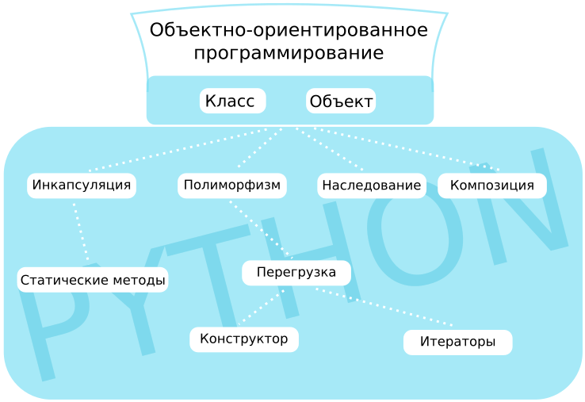

# Объектно-ориентированное программирование в Python

## Введение в ООП

Объектно-ориентированное программирование (ООП) — это парадигма программирования, основанная на концепции объектов, которые объединяют данные (атрибуты) и функции (методы) для их обработки. Python поддерживает ООП, позволяя создавать классы и объекты для моделирования реальных сущностей.



## Классы, объекты, экземпляры классов

**Класс** — это шаблон, определяющий структуру и поведение объектов.

**Объект** (или экземпляр класса) — это конкретная реализация класса с определёнными значениями атрибутов. В Python все классы наследуются от базового класса `object`.

**Пример**:

```python
class Employee:
    def __init__(self, name, salary):
        self.name = name
        self.salary = salary

emp1 = Employee("Елизавета", 2000)
emp2 = Employee("Мария", 5000)
print(f"Имя: {emp1.name}, Зарплата: {emp1.salary}")  # Имя: Елизавета, Зарплата: 2000
```

### Атрибуты класса

**Атрибуты класса** — это переменные, общие для всех объектов класса, определённые вне методов, обычно в начале класса.

**Пример**:

```python
class Employee:
    empCount = 0  # Атрибут класса

    def __init__(self, name, age):
        self.name = name
        self.age = age
        Employee.empCount += 1

e1 = Employee("Иван", 24)
e2 = Employee("Раджеш", 26)
print(f"Количество сотрудников: {Employee.empCount}")  # Количество сотрудников: 2
```

### Атрибуты экземпляра класса

**Атрибуты экземпляра** уникальны для каждого объекта и обычно определяются в методе `__init__`.

**Пример**:

```python
class Student:
    def __init__(self, name, grade):
        self.name = name  # Атрибут экземпляра
        self.grade = grade

student1 = Student("Иван", "5")
print(f"Имя: {student1.name}, Оценка: {student1.grade}")  # Имя: Иван, Оценка: 5
```

### Функции как атрибут класса

Функции, определённые в классе, становятся методами и могут быть атрибутами класса. Они доступны через имя класса или объекта.

**Пример**:

```python
class Employee:
    def display(self):
        print("Метод класса")

Employee.display_func = lambda cls: print("Функция как атрибут класса")
Employee.display_func()  # Функция как атрибут класса
```

## Методы экземпляра. Аргумент self

**Методы экземпляра** — это функции, определённые в классе, которые работают с атрибутами экземпляра. Они принимают `self` как первый аргумент, указывающий на вызывающий объект.

**Пример**:

```python
class Employee:
    def __init__(self, name):
        self.name = name

    def display(self):
        print(f"Имя сотрудника: {self.name}")

emp = Employee("Иван")
emp.display()  # Имя сотрудника: Иван
```

## Инициализация экземпляра. Метод __init__

Метод `__init__` — это конструктор, вызываемый автоматически при создании объекта для инициализации его атрибутов.

**Пример**:

```python
class Employee:
    def __init__(self, name="Иван", age=24):
        self.name = name
        self.age = age

    def display(self):
        print(f"Имя: {self.name}, Возраст: {self.age}")

e1 = Employee()
e1.display()  # Имя: Иван, Возраст: 24
```

## Практика: Создание класса и его методов

**Задание**: Создайте класс `Car` с атрибутами `brand` и `speed`, а также методами для увеличения и уменьшения скорости.

```python
class Car:
    def __init__(self, brand, speed=0):
        self.brand = brand
        self.speed = speed

    def accelerate(self, increment):
        self.speed += increment
        return f"{self.brand} движется со скоростью {self.speed} км/ч"

    def brake(self, decrement):
        self.speed = max(0, self.speed - decrement)
        return f"{self.brand} движется со скоростью {self.speed} км/ч"

car = Car("Toyota")
print(car.accelerate(50))  # Toyota движется со скоростью 50 км/ч
print(car.brake(20))       # Toyota движется со скоростью 30 км/ч
```

## Моносостояние для экземпляров класса

Моносостояние (singleton) — это паттерн, при котором класс имеет только один экземпляр. В Python это можно реализовать через атрибут класса.

**Пример**:

```python
class Singleton:
    _instance = None

    def __new__(cls):
        if cls._instance is None:
            cls._instance = super().__new__(cls)
        return cls._instance

s1 = Singleton()
s2 = Singleton()
print(s1 is s2)  # True
```

## Публичные, приватные, защищённые атрибуты и методы

- **Публичные**: Доступны везде (без префикса).
- **Защищённые**: (`_`) Предназначены для внутреннего использования, но доступны извне.
- **Приватные**: (`__`) Доступны только внутри класса через манглинг имён.

**Пример**:

```python
class Employee:
    def __init__(self, name, age, salary):
        self.name = name        # Публичный
        self._salary = salary    # Защищённый
        self.__age = age        # Приватный

    def display(self):
        print(f"Имя: {self.name}, Зарплата: {self._salary}, Возраст: {self.__age}")

e1 = Employee("Иван", 24, 10000)
print(e1.name)          # Иван
print(e1._salary)       # 10000
print(e1._Employee__age)  # 24
```

## Геттеры, сеттеры, делитеры, свойства

Геттеры, сеттеры и делитеры управляют доступом к атрибутам. Свойства (`property`) упрощают их использование.

**Пример**:

```python
class Employee:
    def __init__(self, name, age):
        self.__name = name
        self.__age = age

    def get_name(self):
        return self.__name

    def set_name(self, name):
        self.__name = name

    def get_age(self):
        return self.__age

    def set_age(self, age):
        self.__age = age

    name = property(get_name, set_name, "name")
    age = property(get_age, set_age, "age")

e1 = Employee("Иван", 24)
print(f"Имя: {e1.name}, Возраст: {e1.age}")  # Имя: Иван, Возраст: 24
e1.name = "Архана"
print(f"Имя: {e1.name}")  # Имя: Архана
```

## Декоратор Property

Декоратор `@property` упрощает создание свойств, заменяя явные геттеры и сеттеры.

**Пример**:

```python
class Employee:
    def __init__(self, name):
        self._name = name

    @property
    def name(self):
        return self._name

    @name.setter
    def name(self, value):
        self._name = value

e1 = Employee("Иван")
print(e1.name)  # Иван
e1.name = "Елизавета"
print(e1.name)  # Елизавета
```

## Вычисляемые атрибуты

Вычисляемые атрибуты возвращают значения, рассчитанные на основе других данных.

**Пример**:

```python
class Rectangle:
    def __init__(self, width, height):
        self.width = width
        self.height = height

    @property
    def area(self):
        return self.width * self.height

rect = Rectangle(5, 3)
print(rect.area)  # 15
```

## Classmethod и staticmethod

- **@classmethod**: Принимает `cls`, работает с атрибутами класса.
- **@staticmethod**: Не принимает `self` или `cls`, используется как утилитная функция.

**Пример**:

```python
class Employee:
    empCount = 0

    def __init__(self, name):
        self.name = name
        Employee.empCount += 1

    @classmethod
    def showcount(cls):
        print(f"Количество сотрудников: {cls.empCount}")

    @staticmethod
    def info():
        print("Это класс Employee")

e1 = Employee("Иван")
Employee.showcount()  # Количество сотрудников: 1
Employee.info()       # Это класс Employee
```

## Пространство имен класса

Пространство имён класса хранится в атрибуте `__dict__`, содержащем все атрибуты и методы класса.

**Пример**:

```python
class Employee:
    empCount = 0

    def __init__(self, name):
        self.name = name

print(Employee.__dict__)
```

**Вывод**:

```
{'__module__': '__main__', 'empCount': 0, '__init__': <function ...>, ...}
```

## Практика по методам и свойствам (property)

**Задание**: Создайте класс `Circle` с радиусом, вычисляемыми свойствами площади и периметра.

```python
import math

class Circle:
    def __init__(self, radius):
        self._radius = radius

    @property
    def radius(self):
        return self._radius

    @radius.setter
    def radius(self, value):
        if value < 0:
            raise ValueError("Радиус не может быть отрицательным")
        self._radius = value

    @property
    def area(self):
        return math.pi * self._radius ** 2

    @property
    def perimeter(self):
        return 2 * math.pi * self._radius

circle = Circle(5)
print(f"Площадь: {circle.area:.2f}")  # Площадь: 78.54
print(f"Периметр: {circle.perimeter:.2f}")  # Периметр: 31.42
```

## Введение в магические методы

Магические методы (или специальные методы) начинаются и заканчиваются двойным подчеркиванием (например, `__init__`). Они позволяют настраивать поведение объектов.

## Магические методы __str__ и __repr__

- `__str__`: Возвращает читаемое строковое представление объекта.
- `__repr__`: Возвращает формальное строковое представление для разработчиков.

**Пример**:

```python
class Point:
    def __init__(self, x, y):
        self.x = x
        self.y = y

    def __str__(self):
        return f"Point({self.x}, {self.y})"

    def __repr__(self):
        return f"Point(x={self.x}, y={self.y})"

p = Point(1, 2)
print(str(p))  # Point(1, 2)
print(repr(p))  # Point(x=1, y=2)
```

## Магические методы __len__ и __abs__

- `__len__`: Возвращает длину объекта.
- `__abs__`: Возвращает абсолютное значение.

**Пример**:

```python
class Vector:
    def __init__(self, x, y):
        self.x = x
        self.y = y

    def __len__(self):
        return int((self.x ** 2 + self.y ** 2) ** 0.5)

    def __abs__(self):
        return (self.x ** 2 + self.y ** 2) ** 0.5

v = Vector(3, 4)
print(len(v))  # 5
print(abs(v))  # 5.0
```

## Магические методы для математических операций

Магические методы, такие как `__add__`, `__sub__`, `__mul__`, позволяют переопределять математические операции.

**Пример**:

```python
class Vector:
    def __init__(self, x, y):
        self.x = x
        self.y = y

    def __add__(self, other):
        return Vector(self.x + other.x, self.y + other.y)

    def __str__(self):
        return f"Vector({self.x}, {self.y})"

v1 = Vector(2, 3)
v2 = Vector(1, 4)
print(v1 + v2)  # Vector(3, 7)
```

## Магические методы для операций сравнения

Методы, такие как `__eq__`, `__lt__`, `__gt__`, определяют поведение операторов сравнения.

**Пример**:

```python
class Point:
    def __init__(self, x):
        self.x = x

    def __eq__(self, other):
        return self.x == other.x

    def __lt__(self, other):
        return self.x < other.x

p1 = Point(1)
p2 = Point(1)
p3 = Point(2)
print(p1 == p2)  # True
print(p1 < p3)   # True
```

## Магический метод __bool__

Метод `__bool__` определяет, как объект интерпретируется в булевом контексте.

**Пример**:

```python
class Point:
    def __init__(self, x, y):
        self.x = x
        self.y = y

    def __bool__(self):
        return self.x != 0 or self.y != 0

p1 = Point(0, 0)
p2 = Point(1, 2)
print(bool(p1))  # False
print(bool(p2))  # True
```

## Магический метод __call__

Метод `__call__` позволяет вызывать объект как функцию.

**Пример**:

```python
class Multiplier:
    def __init__(self, factor):
        self.factor = factor

    def __call__(self, x):
        return self.factor * x

m = Multiplier(2)
print(m(5))  # 10
```

## Полиморфизм в Python

Полиморфизм позволяет одному методу иметь разные реализации в разных классах. Это достигается через утиную типизацию, переопределение методов и перегрузку операторов.

**Пример утиной типизации**:

```python
class Duck:
    def sound(self):
        return "Кря-кря!"

class AnotherBird:
    def sound(self):
        return "Я похож на утку!"

def makeSound(bird):
    print(bird.sound())

duck = Duck()
another_bird = AnotherBird()
makeSound(duck)         # Кря-кря!
makeSound(another_bird) # Я похож на утку!
```

## Методы __getitem__, __setitem__ и __delitem__

Эти методы позволяют объекту вести себя как контейнер (например, словарь или список).

**Пример**:

```python
class Storage:
    def __init__(self):
        self.data = {}

    def __getitem__(self, key):
        return self.data[key]

    def __setitem__(self, key, value):
        self.data[key] = value

    def __delitem__(self, key):
        del self.data[key]

s = Storage()
s["key1"] = 100
print(s["key1"])  # 100
del s["key1"]
```

## Остальные магические методы

Другие магические методы включают:
- `__new__`: Создаёт объект до вызова `__init__`.
- `__del__`: Вызывается при уничтожении объекта.
- `__getattr__`, `__setattr__`: Управляют доступом к атрибутам.

**Пример**:

```python
class Dynamic:
    def __getattr__(self, name):
        return f"Атрибут {name} не найден"

d = Dynamic()
print(d.unknown)  # Атрибут unknown не найден
```

## Принцип наследования в ООП

Наследование позволяет создавать новый класс на основе существующего, наследуя его атрибуты и методы.

**Пример**:

```python
class Parent:
    def parentMethod(self):
        print("Вызов метода родителя")

class Child(Parent):
    def childMethod(self):
        print("Вызов метода потомка")

c = Child()
c.childMethod()   # Вызов метода потомка
c.parentMethod()  # Вызов метода родителя
```

## Наследование от object и других встроенных типов

Все классы в Python наследуются от `object`. Можно также наследовать от встроенных типов, таких как `list` или `dict`.

**Пример**:

```python
class MyList(list):
    def even_elements(self):
        return [x for x in self if x % 2 == 0]

ml = MyList([1, 2, 3, 4])
print(ml.even_elements())  # [2, 4]
```

## Переопределение методов в Python

Переопределение методов позволяет дочернему классу изменять поведение родительского метода.

**Пример**:

```python
class Employee:
    def getSalary(self):
        return 9000

class SalesOfficer(Employee):
    def __init__(self, incentive):
        self.incentive = incentive

    def getSalary(self):
        return super().getSalary() + self.incentive

s = SalesOfficer(1000)
print(s.getSalary())  # 10000
```

## Расширение класса в Python

Расширение класса добавляет новые методы или атрибуты в дочерний класс.

**Пример**:

```python
class Employee:
    def __init__(self, name):
        self.name = name

class Manager(Employee):
    def __init__(self, name, department):
        super().__init__(name)
        self.department = department

m = Manager("Иван", "Developer")
print(f"Имя: {m.name}, Отдел: {m.department}")  # Имя: Иван, Отдел: Developer
```

## Делегирование в Python

Делегирование — это передача выполнения метода другому объекту.

**Пример**:

```python
class Engine:
    def start(self):
        return "Двигатель запущен"

class Car:
    def __init__(self):
        self.engine = Engine()

    def start(self):
        return self.engine.start()

car = Car()
print(car.start())  # Двигатель запущен
```

## Множественное наследование

Множественное наследование позволяет классу наследовать от нескольких родительских классов.

**Пример**:

```python
class Division:
    def divide(self, a, b):
        return a / b

class Modulus:
    def mod(self, a, b):
        return a % b

class Calculator(Division, Modulus):
    pass

calc = Calculator()
print(calc.divide(10, 3))  # 3.333...
print(calc.mod(10, 3))     # 1
```

## MRO - Порядок разрешения методов

**MRO** (Method Resolution Order) определяет порядок поиска методов в иерархии наследования. Используется метод `__mro__` или `mro()`.

**Пример**:

```python
class A:
    pass

class B(A):
    pass

class C(B):
    pass

print(C.__mro__)  # (<class '__main__.C'>, <class '__main__.B'>, <class '__main__.A'>, <class 'object'>)
```

## Миксины

Миксины — это классы, предоставляющие методы для использования в других классах через наследование.

**Пример**:

```python
class JsonMixin:
    def to_json(self):
        import json
        return json.dumps(self.__dict__)

class Employee:
    def __init__(self, name):
        self.name = name

class JsonEmployee(Employee, JsonMixin):
    pass

e = JsonEmployee("Иван")
print(e.to_json())  # {"name": "Иван"}
```

## Slots

`__slots__` ограничивает атрибуты класса, экономя память и ускоряя доступ.

**Пример**:

```python
class Point:
    __slots__ = ['x', 'y']

    def __init__(self, x, y):
        self.x = x
        self.y = y

p = Point(1, 2)
# p.z = 3  # Ошибка: нет атрибута z
```

## Slots: свойства (property) и наследование

`__slots__` не наследуются автоматически, но дочерние классы могут добавлять свои `__slots__`. Свойства работают с `__slots__`.

**Пример**:

```python
class Point:
    __slots__ = ['_x']

    def __init__(self, x):
        self._x = x

    @property
    def x(self):
        return self._x

    @x.setter
    def x(self, value):
        self._x = value

class ColoredPoint(Point):
    __slots__ = ['color']

    def __init__(self, x, color):
        super().__init__(x)
        self.color = color

p = ColoredPoint(1, "red")
print(p.x, p.color)  # 1 red
```

## Исключения в Python

Исключения — это ошибки, возникающие во время выполнения программы. Python предоставляет механизмы для их обработки.

**Пример**:

```python
try:
    x = 1 / 0
except ZeroDivisionError:
    print("Деление на ноль!")
```

### Распространение исключений

Исключения передаются вверх по стеку вызовов, пока не будут обработаны.

**Пример**:

```python
def divide(a, b):
    return a / b

try:
    divide(10, 0)
except ZeroDivisionError:
    print("Ошибка деления!")
```

### Обработка исключений try-except

Конструкция `try-except` обрабатывает исключения.

**Пример**:

```python
try:
    x = int("abc")
except ValueError:
    print("Неверный формат числа!")
else:
    print("Успешно!")
finally:
    print("Выполняется всегда")
```

### Инструкция raise

`raise` вызывает исключение вручную.

**Пример**:

```python
def check_age(age):
    if age < 0:
        raise ValueError("Возраст не может быть отрицательным")
    return age

try:
    check_age(-5)
except ValueError as e:
    print(e)  # Возраст не может быть отрицательным
```

### Пользовательские исключения

Можно создавать свои классы исключений, наследуя от `Exception`.

**Пример**:

```python
class CustomError(Exception):
    pass

try:
    raise CustomError("Моя ошибка")
except CustomError as e:
    print(e)  # Моя ошибка
```

## Абстрактные классы

Абстрактные классы определяют интерфейс, который должен быть реализован в дочерних классах. Используется модуль `abc`.

**Пример**:

```python
from abc import ABC, abstractmethod

class Shape(ABC):
    @abstractmethod
    def draw(self):
        pass

class Circle(Shape):
    def draw(self):
        print("Рисуем круг")

c = Circle()
c.draw()  # Рисуем круг
```

## Протоколы

Протоколы — это неформальные интерфейсы, определяемые набором методов, которые должен реализовать объект.

## Протокол итератора: магические методы __iter__ и __next__

Протокол итератора позволяет объекту быть итерируемым.

**Пример**:

```python
class Counter:
    def __init__(self, limit):
        self.limit = limit
        self.current = 0

    def __iter__(self):
        return self

    def __next__(self):
        if self.current < self.limit:
            self.current += 1
            return self.current
        raise StopIteration

c = Counter(3)
for num in c:
    print(num)  # 1, 2, 3
```

## Продолжение про итераторы

Итераторы могут быть использованы для ленивых вычислений.

**Пример**:

```python
class Fibonacci:
    def __init__(self, max_n):
        self.max_n = max_n
        self.a, self.b = 0, 1
        self.count = 0

    def __iter__(self):
        return self

    def __next__(self):
        if self.count < self.max_n:
            result = self.a
            self.a, self.b = self.b, self.a + self.b
            self.count += 1
            return result
        raise StopIteration

fib = Fibonacci(5)
print(list(fib))  # [0, 1, 1, 2, 3]
```

## Протокол менеджера контекста

Протокол менеджера контекста использует методы `__enter__` и `__exit__` для работы с конструкцией `with`.

**Пример**:

```python
class Resource:
    def __enter__(self):
        print("Ресурс открыт")
        return self

    def __exit__(self, exc_type, exc_val, exc_tb):
        print("Ресурс закрыт")

with Resource() as r:
    print("Работа с ресурсом")
# Вывод:
# Ресурс открыт
# Работа с ресурсом
# Ресурс закрыт
```

## Протокол менеджера контекста: часть 2

Метод `__exit__` может обрабатывать исключения.

**Пример**:

```python
class SafeResource:
    def __enter__(self):
        return self

    def __exit__(self, exc_type, exc_val, exc_tb):
        if exc_type:
            print(f"Обработано исключение: {exc_val}")
        return True  # Подавить исключение

with SafeResource():
    raise ValueError("Ошибка!")
print("Программа продолжает работу")
```

## Протокол дескриптора. Типы дескрипторов

Дескрипторы — это объекты, реализующие методы `__get__`, `__set__`, `__delete__`.

**Пример**:

```python
class Descriptor:
    def __get__(self, obj, owner):
        return obj._value

    def __set__(self, obj, value):
        obj._value = value

class MyClass:
    value = Descriptor()

obj = MyClass()
obj.value = 10
print(obj.value)  # 10
```

**Типы дескрипторов**:
- **Data descriptor**: Реализует `__get__` и `__set__`.
- **Non-data descriptor**: Реализует только `__get__`.

## Порядок поиска имен при использовании дескриптора

Python сначала ищет атрибут в `__dict__` объекта, затем в дескрипторах, затем в `__dict__` класса и его родителей.

## Знакомство с dataclass

`dataclass` упрощает создание классов для хранения данных, автоматически добавляя `__init__`, `__repr__`, `__eq__`.

**Пример**:

```python
from dataclasses import dataclass

@dataclass
class Employee:
    name: str
    salary: int

e = Employee("Иван", 10000)
print(e)  # Employee(name='Иван', salary=10000)
```

## dataclass: продолжение

Можно настроить поведение `dataclass` с помощью параметров, таких как `frozen` или `order`.

**Пример**:

```python
@dataclass(frozen=True, order=True)
class Point:
    x: int
    y: int

p1 = Point(1, 2)
p2 = Point(2, 1)
print(p1 < p2)  # True
```

## dataclass: дополнительные возможности

Можно добавлять методы и использовать `field` для настройки полей.

**Пример**:

```python
from dataclasses import dataclass, field

@dataclass
class InventoryItem:
    name: str
    quantity: int = field(default=0)

    def add_stock(self, amount):
        self.quantity += amount

item = InventoryItem("Яблоки")
item.add_stock(10)
print(item)  # InventoryItem(name='Яблоки', quantity=10)
```

## Перечисления

Модуль `enum` позволяет создавать перечисления.

**Пример**:

```python
from enum import Enum

class Color(Enum):
    RED = 1
    GREEN = 2
    BLUE = 3

print(Color.RED)  # Color.RED
print(Color.RED.value)  # 1
```