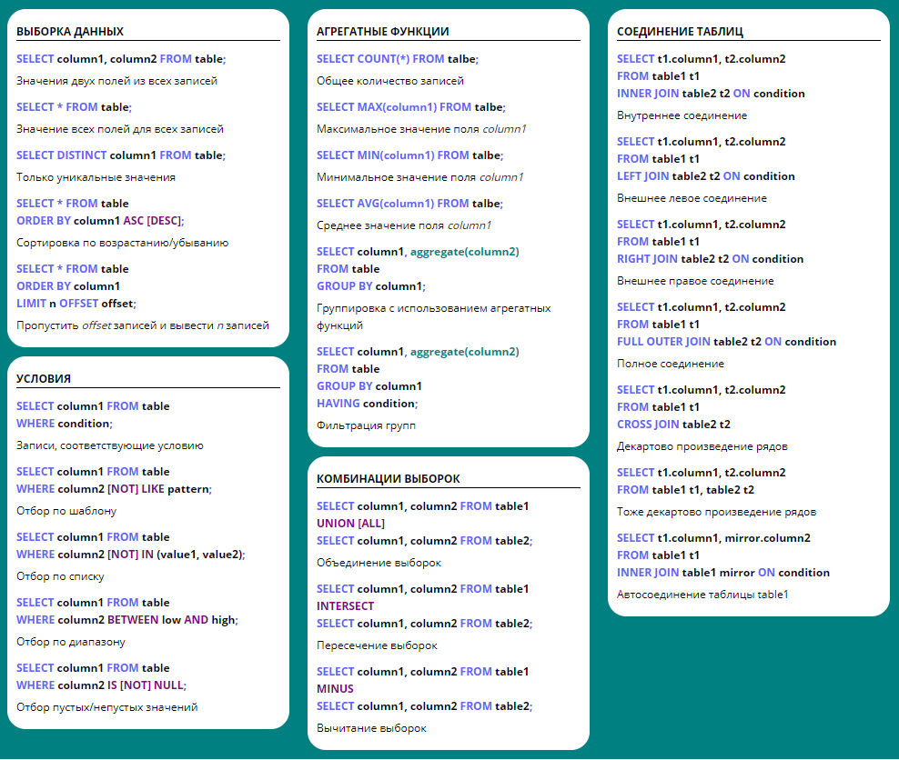
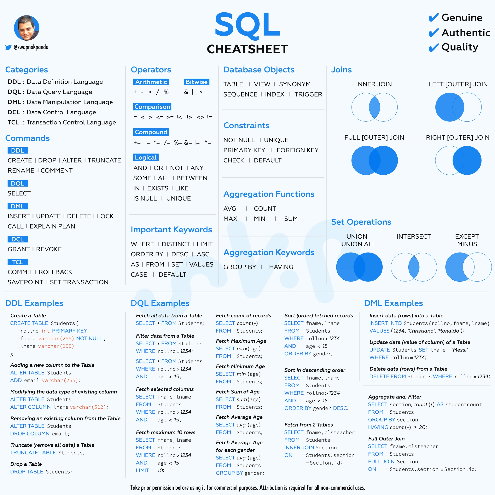

## Выборка данных

Для получения данных из базы служит оператор `SELECT`. В SQL есть множество способов отфильтровать именно те данные, которые вам нужны, а также отсортировать их и разбить по группам.

## Демо-база данных

Ниже приведена небольшая демо-база, на которой вы можете попрактиковаться:

```sql
CREATE TABLE departments (
  id INT AUTO_INCREMENT PRIMARY KEY,
  name VARCHAR(20)
);

CREATE TABLE employees (
  id INT AUTO_INCREMENT PRIMARY KEY,
  name VARCHAR(50),
  department INT,
  salary INT,
  boss INT
);

INSERT INTO departments (name) 
VALUES ("administration"), ("accounting"), 
       ("customer service"), ("finance"), 
       ("legal"), ("logistics"), 
       ("orders"), ("purchasing");

INSERT INTO employees (name, department, salary, boss) 
VALUES 
  ('John Doe', 1, 40000, NULL),
  ('Jane Smith', 1, 35000, 1),
  ('Fred Brown', 1, 48000, 1),
  ('Kevin Jones', 2, 36000, NULL),
  ('Josh Taylor', 2, 22000, 4),
  ('Alex Clark', 2, 29000, 5),
  ('Branda Evans', 2, 27000, 5),
  ('Anthony Ford', 4, 32000, NULL),
  ('David Moore', 4, 29000, 8),
  ('Scott Riley', 5, 20000, NULL),
  ('Chris Gilmore', 5, 28000, 10),
  ('Roberta Newman', 5, 33000, 11),
  ('Kenny Washington', NULL, 55000, NULL);
```

### **Оператор SELECT**

Синтаксис команды SELECT:

```sql

SELECT <поле1>, <поле2>,....
FROM <имя_таблицы>
[ WHERE <условия> ]
[ GROUP BY <условие> ] [HAVING условие]
[ ORDER BY <поле> [DESC]]
[ LIMIT <начало>, <Число записей>]

```

``` sql -- Получить все поля из всех записей
SELECT * FROM employees;

-- Получить только имена и зарплаты всех работников
SELECT name, salary FROM employees;

Переименование полей
SELECT name AS employee FROM employees; 
```


**Фильтрация с WHERE**
| Операция      | Название | Пример |
| :--------- | :------: | ----: |
| = |   равно   | salary = 20000 |
| >    |   больше   | salary > 20000 |
| < |   меньше   | salary < 20000 |
| <= |   больше или равно   | salary <= 20000 |
| >= |   меньше или равно   | salary >= 20000 |
| !=  |   не равно   | salary != 20000 |
| IS NOT NULL |   не пусто   | salary is not null |
| IS NULL |   пусто   | salary is null |
| BETWEEN |   в диапазоне   | salary BETWEEN  25000 and 30000|
| LIKE |   соответствует шаблону   | name like '%John'|
| NOT LIKE |  не соответствует шаблону   | name not like '%John'|
| IN |   во множестве   | salary in (20000, 25000) |
| NOT IN |   не во множестве   | salary not in (20000, 25000)  |

``` sql -- Имена работников, зарплата которых выше 20 тысяч
SELECT name FROM employees WHERE salary > 20000;

-- Все сотрудники с зарплатой от 25 до 30 тысяч
SELECT name FROM employees WHERE salary BETWEEN 25000 AND 30000;

-- Все Джоны среди работников
SELECT * FROM employees WHERE name LIKE "john%";

-- Все сотрудники, кроме Джонов и Джонсов
SELECT * FROM employees 
WHERE name NOT LIKE "john%" AND name NOT LIKE "%jones";

-- Все сотрудники юридического отдела, администрации и бухгалтерии
SELECT * FROM employees WHERE department IN (1, 2, 5);

-- Все сотрудники, у которых нет начальников
SELECT * FROM employees WHERE boss IS NULL;
```

**Сортировка результатов**

``` sql -- По уменьшению зарплаты (от высокой к низкой)
SELECT name, salary FROM employees ORDER BY salary DESC;

-- По увеличению зарплаты (от низкой к высокой)
SELECT name, salary FROM employees ORDER BY salary ASC;
```

**Ограничение количества результатов**

``` sql -- Пять самых высокооплачиваемых работников
SELECT name FROM employees ORDER BY salary DESC LIMIT 5;

-- Все работники, кроме пяти самых высокооплачиваемых
SELECT name FROM employees ORDER BY salary DESC OFFSET 5;
```

**Агрегатные функции и группировка**
``` sql
-- Общее количество работников
SELECT COUNT(*) FROM employees;

-- Работник с максимальной зарплатой
SELECT name, MAX(salary) FROM employees;

-- Работник с минимальной зарплатой
SELECT name, MIN(salary) FROM employees;

-- Средняя зарплата по предприятию
SELECT AVG(salary) FROM employees;

-- Сумма всех зарплат
SELECT SUM(salary) FROM employees;
```


***Группировка с GROUP BY***

```sql -- Максимальная зарплата в каждом отделе
SELECT department, MAX(salary) 
FROM employees 
GROUP BY department;

Фильтрация групп с HAVING
-- Отделы, в которых работает больше 3 человек
SELECT department, MAX(salary) 
FROM employees 
GROUP BY department 
HAVING COUNT(*) > 3;
```

**Соединение таблиц**

*Внутреннее соединение (INNER JOIN)*

``` sql 
SELECT employees.name, employees.salary, departments.name AS department
FROM employees 
INNER JOIN departments 
ON employees.department = departments.id;
```

> Результат содержит только строки, где есть совпадение в обеих таблицах.
Kenny Washington (без отдела) и пустые отделы не попадут в выборку.


*Внешнее соединение*

Левое внешнее соединение (LEFT JOIN)

``` sql
SELECT employees.name, employees.salary, departments.name AS department
FROM employees 
LEFT JOIN departments 
ON employees.department = departments.id;
```
> Включает все строки из левой таблицы (employees), даже если нет соответствия в правой.


Правое внешнее соединение (RIGHT JOIN)

``` sql 
SELECT employees.name, employees.salary, departments.name 
FROM employees 
RIGHT JOIN departments 
ON employees.department = departments.id;
```

> Включает все отделы, даже если в них нет сотрудников.


Полное внешнее соединение (FULL JOIN)

``` sql SELECT employees.name, employees.salary, departments.name 
FROM employees 
FULL JOIN departments 
ON employees.department = departments.id;
```
>    Включает все строки из обеих таблиц — и сотрудников без отдела, и отделы без сотрудников. 
     
> FULL JOIN не поддерживается в MySQL, но доступен в PostgreSQL, SQLite (с расширением), и других СУБД. 

Декартово произведение (CROSS JOIN)


``` sql
SELECT * FROM employees CROSS JOIN departments;
```
>Создаёт все возможные комбинации строк из двух таблиц.

Автосоединение (SELF JOIN)

Найти имя босса для каждого сотрудника:

``` sql SELECT e1.name, e1.department, e2.name AS boss 
FROM employees e1 
LEFT JOIN employees e2 
ON e1.boss = e2.id;
```
> Используется LEFT JOIN, чтобы включить сотрудников без начальника (например, CEO).


**Объединение таблиц**

UNION — объединение результатов

``` sql -- Объединить штатных и внештатных сотрудников (без дубликатов)
SELECT * FROM employees
UNION
SELECT * FROM freelancers;

-- С дубликатами
SELECT * FROM employees
UNION ALL
SELECT * FROM freelancers;
```

INTERSECT — пересечение

``` sql -- Сотрудники, участвующие в сборной по спортивной ходьбе
SELECT name FROM employees
INTERSECT
SELECT name FROM race_walking_team;
```
> Поддерживается не во всех СУБД (например, нет в MySQL, есть в PostgreSQL).

MINUS / EXCEPT — разность

``` sql -- Сотрудники, не участвующие в сборной
SELECT name FROM employees
EXCEPT
SELECT name FROM race_walking_team;
```
> В PostgreSQL используется EXCEPT, в Oracle — MINUS. В MySQL аналог достигается через LEFT JOIN и IS NULL.


**Подзапросы**

Подпрос - это запрос внутри запроса. 

Использование подзапросов не добавляет новых функциональных возможностей, однако, упрощает чтение самого запроса

Бывают:
  - коррелированные (требуется ссылаться на значение столбца в текущей строке внешнего запроса)

```sql
-- Приобретенные товары, у которых число купленных товарных позиций совпадает с запасами на складе
SELECT name, count from products
WHERE count = (SELECT sum(count) from orders
               where orders.product_id = products.id)
```
  - некоррелированные

```sql
SELECT * FROM `employees` WHERE salary > (SELECT AVG(salary) FROM employees)
```





