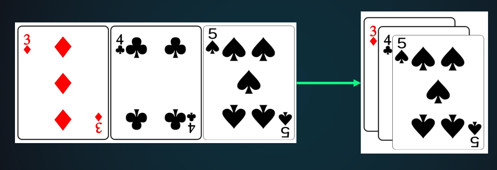

# Позиционирование элементов на странице

Вся идея позиционирования заключается в том, чтобы позволить нам переопределять поведение базового потока документа, для того чтобы производить интересные эффекты. Что если вам захочется слегка изменить позицию каких-либо блоков внутри макета относительно их позиции в потоке макета по умолчанию? Ваш инструмент - позиционирование. Или если вы хотите создать элемент пользовательского интерфейса, который плавает над другими частями страницы и/или всегда располагается на одном и том же месте в окне браузера не зависимо от того сколько прокручивалась страница? Позиционирование делает возможным работу таких макетов.

Существует несколько разных типов позиционирования, которые вы можете применить к элементам HTML. 

Для активации специфического типа позиционирования у элемента, мы используем свойство `position`.



## 🧩 Типы позиционирования

Свойство `position` принимает следующие значения:

- `static` — по умолчанию
- `relative`
- `absolute`
- `fixed`
- `sticky`

## 1 `position: static` (по умолчанию)

Элементы с `static` не реагируют на свойства `top`, `right`, `bottom`, `left`, `z-index`.

```css
.box {
  position: static; /* это значение по умолчанию, можно не указывать */
  top: 20px; /* НЕ СРАБОТАЕТ! */
}
```


##  2 `position: relative`

Элемент остаётся в потоке документа, но его можно сдвинуть относительно его исходной позиции с помощью top, right, bottom, left.

```html

<div class="container">
  <div class="box">Я relative</div>
  <div class="box">Я обычный брат</div>
</div>


box {
  width: 100px;
  height: 100px;
  background: lightblue;
  margin: 10px;
}

.box:first-child {
  position: relative;
  top: 20px;
  left: 30px;
  background: coral;
}

```


##  3 `position: absolute`

Элемент выводится из потока документа и позиционируется относительно ближайшего позиционированного предка (у которого position не static). Если такого нет — относительно <body>.

```html
<div class="parent">
  <div class="child">Я absolute</div>
</div>

.parent {
  position: relative; /* делаем родителя "позиционированным" */
  width: 300px;
  height: 200px;
  background: #eee;
}

.child {
  position: absolute;
  top: 20px;
  right: 10px;
  width: 100px;
  height: 50px;
  background: tomato;
}
```

> Всегда задавайте position: relative родителю, если хотите, чтобы absolute-элемент позиционировался внутри него.

##  4 `position: fixed`

Элемент фиксируется относительно окна браузера и не двигается при прокрутке.

```
.header {
  position: fixed;
  top: 0;
  left: 0;
  width: 100%;
  background: #333;
  color: white;
  padding: 10px;
  text-align: center;
}
```
> Часто используется для шапок, футеров, всплывающих кнопок.

##  5 `position: sticky`

Элемент ведёт себя как relative, пока не достигнет определённой позиции при прокрутке — затем становится fixed.

```css
.sidebar {
  position: sticky;
  top: 10px; /* прилипает, когда отступ сверху становится 10px */
  background: #f0f0f0;
  padding: 15px;
}
```

## Координаты `top, right, bottom, left`

```css
.element {
  position: absolute;
  top: 10px;    /* отступ сверху */
  right: 20px;  /* отступ справа */
  bottom: 30px; /* отступ снизу */
  left: 40px;   /* отступ слева */
}
```

## Слои `z-index`

Определяет порядок наложения элементов по оси Z (глубина). Работает только для позиционированных элементов (relative, absolute, fixed, sticky).

```css
.overlay {
  position: absolute;
  z-index: 10; /* будет поверх элементов с z-index 9 и ниже */
}

.background {
  position: relative;
  z-index: 1;
}
```

## Практические примеры


```html

<nav class="menu">
  <ul>
    <li class="dropdown">
      <a href="#">Меню ▼</a>
      <ul class="submenu">
        <li><a href="#">Пункт 1</a></li>
        <li><a href="#">Пункт 2</a></li>
      </ul>
    </li>
  </ul>
</nav>


.dropdown {
  position: relative;
}

.submenu {
  position: absolute;
  top: 100%;
  left: 0;
  display: none;
  background: white;
  border: 1px solid #ccc;
}

.dropdown:hover .submenu {
  display: block;
}

```


```html

<div class="modal-overlay">
  <div class="modal">
    <h3>Важное сообщение!</h3>
    <button>Закрыть</button>
  </div>
</div>


.modal-overlay {
  position: fixed;
  top: 0;
  left: 0;
  width: 100%;
  height: 100%;
  background: rgba(0,0,0,0.5);
  display: flex;
  justify-content: center;
  align-items: center;
  z-index: 1000;
}

.modal {
  background: white;
  padding: 20px;
  border-radius: 8px;
  box-shadow: 0 4px 10px rgba(0,0,0,0.3);
}
```


```html

<div class="content">
  <div class="sidebar">Я прилипаю!</div>
  <div class="main">Основной контент...</div>
</div>


.sidebar {
  position: sticky;
  top: 20px;
  width: 200px;
  background: #f4f4f4;
  padding: 15px;
}

.main {
  margin-left: 220px;
  min-height: 2000px; /* для демонстрации прокрутки */
}
```

## Примеры: 

1. Подводные камни

> Текстовые блоки в колонках. Надежных блоков нет

2. Изменение маркрированных списков