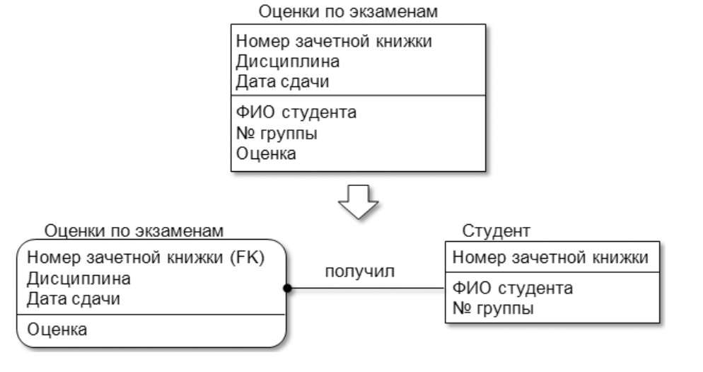
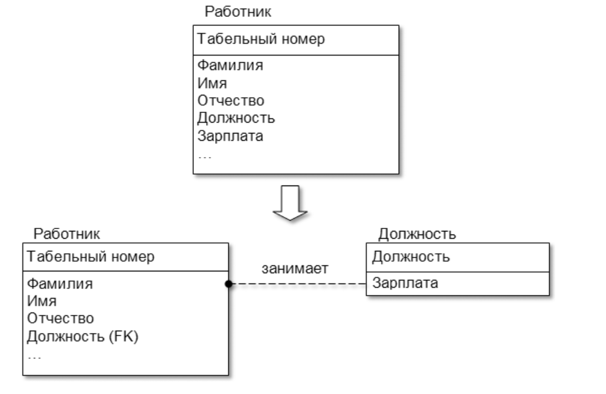
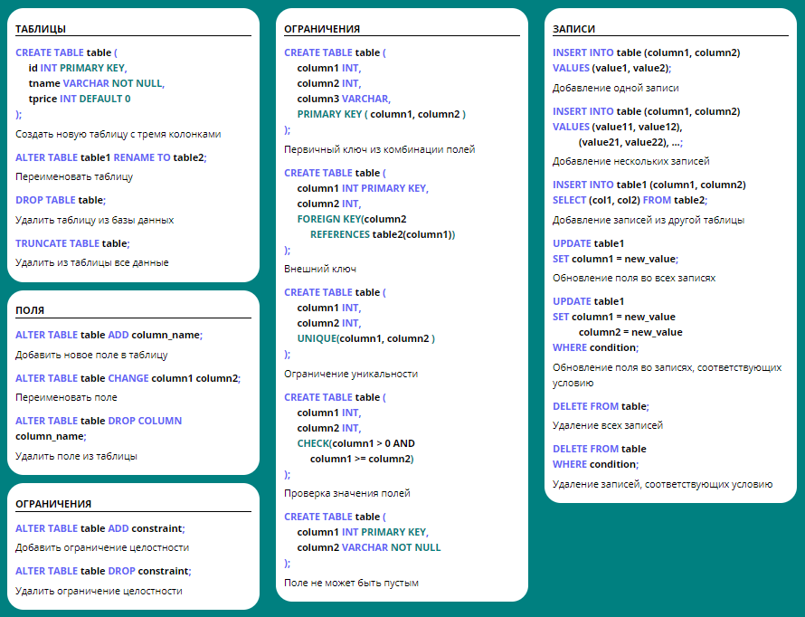

# Практическое занятие: Знакомство с основами построения РБД


## План на занятие
1. Установить необходимый софт для:

- проектирования схемы БД
    Например, [MySQL workbanch](https://dev.mysql.com/downloads/workbench/). Документация к MySQLWorkbanch: https://dev.mysql.com/doc/workbench/en/

- запуска СУБД (на примере MySQL) 
    Например, [XAMPP](https://www.apachefriends.org/download.html)

2. Рассмотреть ключевые понятия:
    - предметная область
    - правила предметной области
    - сущность, связь
    - таблица
    - атрибут
    - тип данных 
    - ограничение целостности

3. Выбрать предметную область и выделить основные сущности и связи

4. Спроектировать физическую схему базы данных в соответствии с 1-3 нормальными формами

5. Подключиться к базе данных и импортировать схему базы данных

6. Изменить структуру таблицы(столбца)

7. Научиться вставлять данные в таблицы

8. Заполнить отчет


# Проектирование схемы реляционной базы данных

## Проектирование РБД
Реляционная база данных ("РБД") - это основа для многих приложений и систем хранения данных.

### Нормализация

Приводить данные к нормальным формам можно только последовательно

**Первая нормальная форма (1НФ)**
Каждый столбец таблицы содержит только один тип данных, и не может быть повторяющихся групп значений в одной записи.
(отсутствие дубликатов и составных типов данных)
Пример: ФИО (При выборе имени может дополнительно попадать в выборку отчество или фамилия). Перечисление модели автомобиля в одном столбце (BMW, audi, lada => переносим в отдельные строки)

Степень неделимости (атомарности), т.е. решение о том, следует разбивать неатомарный атрибут на атомарные или оставить его псевдоатомарным, определяется проектировщиком БД исходя из конкретных условий. Если при обработке таблиц нет необходимости различать атомарные составляющие псевдоатомарного атрибута, то его можно не делить (например, атрибуты «Фамилия, имя, отчество», «Адрес» и т. д.).


**Вторая нормальная форма (2НФ)**
Каждая запись таблицы имеет первичный ключ, а все не первичные столбцы зависят только от первичного ключа.

Например, таблица `«Оценки по экзаменам»` характеризуется следующим набором атрибутов 
`{Номер зачетной книжки, Дисциплина, Дата сдачи, ФИО студента, № группы, Оценка}`.
Очевидно, что первичным ключом является набор `{Номер зачетной книжки, Дисциплина, Дата сдачи}`.
Полной функциональной зависимостью обладает только один неключевой атрибут `«Оценка»`. Атрибуты «ФИО студента» и «№ группы» могут быть однозначно определены по части первичного ключа – «Номер зачетной книжки».
Таким образом, требуется разбиение исходной таблицы на две.



**Третья нормальная форма (3НФ)**.
Каждый столбец таблицы зависит только от первичного ключа или других уникальных столбцов. (отсутствие транзитивных зависимостей)

Например, таблица `«Работник»` характеризуется набором атрибутов `{Табельный номер, Фамилия, Имя, Отчество, Должность, Зарплата, …}`, первичный ключ – `{Табельный номер}`.

    Табельный номер - уникальный номер работника предприятия, учреждения, организации, присваиваемый каждому работнику при приёме на работу, проставляемый во внутренних документах, прежде всего в личном деле, табеле (от которого происходит название) и документах на выплату заработной платы

В этой таблице от первичного ключа (`«Табельный номер»`) зависит неключевой атрибут `«Должность»`, а от `«Должности»` другой неключевой атрибут `«Зарплата»`. Для приведения к 3НФ необходимо добавить новую таблицу.




## Типы данных:

### Числовые типы
| Тип | Диапазон | Память | Описание |
| --- | -------- | ------ | -------- |
| TINYINT[(M)]   | -127..128 или 0..255   | 1 | Очень маленькие целые числа
| BIT   | -   | 1 | Синоним TINYINT
| BOOL   | -   | 1 | Синоним TINYINT
| SMALLINT[(M)]   | -32768..32767 или 0..65535 | 2 | Маленькие целые числа
| MEDIUMINT[(M)]  | -8388608..8388607 или 0..16777215 | 3 | Целые числа средней величины
| INT[(M)] ITEGER[(M)] | -2^31..2^31-1 или 0..2^32-1   | 8 | Большие целые числа
| FLOAT(точность) | Зависит от точности   | Различна | Числа с плавающей точкой одинарной или двойной точности
| FLOAT [(M,D)] | ±1.175494351Е-38 ±3.402823466Е+38 | 4 | Эквивалентно FLOAT, но с указанной шириной отображения и количе-ством десятичных разря-дов
| DOUBLE [(M,D)] | ±1.7976931348Е+308 ±2.2250738585Е-308|	8 |	Эквивалентно FLOAT, но с указанной шириной отображения и количеством десятичных разрядов  
| DOUBLE PRECISION[(M,D)] |±1.7976931348Е+308 ±2.2250738585Е-308 |	8	| Синоним DOUBLE[(M,D)]
| REAL [(M,D)]	| ±1.7976931348Е+308 ±2.2250738585Е-308 |	8 |	Синоним DOUBLE[(M,D)]
| DECIMAL [(M,D)] |	Различный	| М+2 |	Число с плавающей точкой, хранимое как char. Диапазон зависимости зависит от М. |
| NUMERIC [(M,D)] | Различный |М+2 | Синоним DECIMAL[(M,D)]
| DEC [(M,D)] |	Различный	| М+2 |	Синоним DECIMAL[(M,D)]
| FIXED [(M,D)] |Различный | М+2 |Синоним DECIMAL[(M,D)]

### Время и дата

| Тип | Диапазон | Описание |
| --- | -------- | -------- |
| DATE |	|От 1000-01-01 до 9999-12-31|	|Дата. Отображается в виде ГГГГ-ММ-ДД. |
| TIME |	От -838:59:59 до 838:59:59 |	Время. Отображается в виде ЧЧ-ММ-СС. |
|DATETIME |	От 1000-01-01 00:00:00 до 9999-12-31 23:59:59 |	Дата и время. Отображается в виде  ГГГГ-ММ-ДД ЧЧ-ММ-СС |
| TIMESTAMP [(M)]	| От 1970-01-01 00:00:00 до 2038 года	| Метка времени, полезная для отслеживания транзакций. Форма отображения зависит от М.
| YEAR [(2\4)] |	70-69 (1970-2069) 1901-2155 |Год. Может быть указан в двух- или четырёх- символьном формате. |

### Строковые типы
1 группа
| Тип | Диапазон | Описание |
| --- | -------- | -------- |
[NATIONAL] CHAR (M) [BINARY \ ASCII \ UNICODE] |	От 0 до 255 символов |	Строки фиксированной длины М. Ключевое слово NATIONAL указывает на то, что должен использоваться набор символов, установленный по умолчанию. Ключевое слово BINARY указывает, что данные должны рассматриваться как зависящие от регистра (по умолчанию данные зависят от регистра). Ключевое слово ASCII указывает, что для данного столбца будет использоваться набор символов latin1, а ключевое слово UNICODE – набор символов ucs. |
| CHAR	|1	|Синоним CHAR(1).|
| [NATIONAL] VARCHAR(M) [BINARY]| От 0 до 255 символов	| То же самое, за исключением того, что данные могут иметь произвольную длину.

2 группа
| Тип | Максимальная длина (в символах)| Описание |
| --- | -------- | -------- |
|TINYBLOB	|28-1 (255)|	Маленькое поле BLOB|
|TINYTEXT|	28-1 (255)	|Маленькое поле TEXT
|BLOB	|216-1 (65 535)	|Нормальное поле BLOB
|TEXT	|216-1 (65 535)	|Нормальное поле TEXT
|MEDIUMBLOB	|224-1 (16 777 215)	|Среднее поле BLOB
|MEDIUMTEXT	|224-1 (16 777 215)	|Среднее поле TEXT
|LONGBLOB	|232-1 (4 294 967 295)	|Большое поле BLOB
|LONGTEXT	|232-1 (4 294 967 295)	|Большое поле TEXT

3 группа
| Тип | Максимальное количество зна-чений в наборе | Описание |
| --- | -------- | -------- |
| ENUM(’значение1’,’значение2’,...)|	65 535	|Столбцы этого типа могут содержать только одно из перечисленных значений либо NULL.
| SET(’значение1’,’значение2’, ...)	|64 | Столбцы этого типа могут содержать набор указанных значений либо  NULL.

- Ключевые слова и ограничение на значения столбцов
    - `NOT NULL` означает, что все строки таблицы должны иметь значение в этом атрибуте. Если ключевое слово NOT NULL не указано, поле может быть пустым (NULL).
    - `AUTO_INCREMENT` – это специальная возможность MySQL, которую можно использовать применительно к числовым столбцам. Если при вставке строк в таблицу оставить это поле пустым, MySQL автоматически сгенери-рует значение уникального идентификатора. Каждая табли-ца может содержать не более одного такого поля. Столбцы, для которых указано слово AUTO_INCREMENT, должны быть проиндексированы.
    - `PRIMARY KEY`, следующие за именем столбца, указывают, что этот столбец является первичным ключом таблицы. Записи в этом столбце должны быть уни-кальными. Указывать PRIMARY KEY после названия столбца можно лишь тогда, когда первичный ключ состоит лишь из одного столбца.
    - `FOREIGN KEY`  - применяется вместе с определённым раннее первичным ключом или же ограничением уникальности (unique) в связанной таблице. Условие на значение внешнего ключа одной таблицы ставит в соответствие один или несколько столбцов другой таблицы.
    - `UNIQUE` -    назначается чтобы запретить повторение значений в столбце таблицы. Для столбца, на котором определено ограничение первичного ключа, не может быть определено ограничение уникальности, так как уникальный индекс данного столбца уже создан. 


### Возможности команды ALTER
| Синтаксис                                                                 | Описание                                                                                                                                                                                                 |
|---------------------------------------------------------------------------|---------------------------------------------------------------------------------------------------------------------------------------------------------------------------------------------------------|
| `ADD [COLUMN] описание_столбца [FIRST \ AFTER столбец]`                   | Добавляет новый столбец в указанное место. 
| `ADD [COLUMN] (описание_столбца, описание_столбца,...)`                   | Добавляет один или несколько столбцов в конец таблицы.                                                                                                                                                  |
| `ADD INDEX [индекс] (столбец,...)`                                        | Добавляет индекс по указанному столбцу таблицы.                                                                                                                                                         |
| `ADD [CONSTRAINT [символ]] PRIMARY KEY (столбец,...)`                     | Делает указанный столбец первичным ключом таблицы. Конструкция `CONSTRAINT` применяется для таблиц с внешними ключами.                                                                                  |
| `ADD UNIQUE [CONSTRAINT [символ]] [индекс] (столбец,...)`                 | Добавляет уникальный индекс по указанному столбцу таблицы. Конструкция `CONSTRAINT` применяется для таблиц InnoDB с внешними ключами.                                                                   |
| `ADD [CONSTRAINT [символ]] FOREIGN KEY [индекс] (индексный_столбец,...) [определение_ссылки]` | Добавляет в таблицу InnoDB внешний ключ.                                                                                                                                                                |
| `ALTER [COLUMN] столбец {SET DEFAULT значение \ DROP DEFAULT}`            | Добавляет или удаляет значение по умолчанию для определенного столбца.                                                                                                                                  |
| `CHANGE [COLUMN] столбец новое_описание_столбца`                          | Изменяет столбец в соответствии с указанным описанием.                                                                                                                                                 |
| `MODIFY [COLUMN] описание_столбца`                                        | Подобно `CHANGE`. Используется для изменения типов столбцов, но не их имён.                                                                                                                            |
| `DROP [COLUMN] столбец`                                                   | Удаляет столбец.                                                                                                                                                                                       |
| `DROP PRIMARY KEY`                                                        | Удаляет первичный индекс.                                                                                                                                                                              |
| `DROP INDEX индекс`                                                       | Удаляет указанный индекс.                                                                                                                                                                              |
| `DROP FOREIGN KEY ключ`                                                   | Удаляет внешний ключ.                                                                                                                                                                                  |
| `DISABLE KEYS`                                                            | Отключает обновление индексов.                                                                                                                                                                         |
| `ENABLE KEYS`                                                             | Включает обновление индексов.                                                                                                                                                                          |
| `RENAME [AS] новое_имя_таблицы ORDER BY имя_столбца`                                           | Переименовывает таблицу. |
| `CONVERT TO CHARACTER SET набор_символов COLLATE сопоставить`             | Пересоздает таблицу со строками в определённом порядке.                                                                                                                                                |
| `[DEFAULT] CHARACTER SET набор_символов COLLATE сопоставить`              | Преобразует все текстовые столбцы к указанному набору символов и правилам сопоставления.                                                                                                               |
| `DISCARD TABLESPACE`                                                      | Устанавливает набор символов и правила сопоставления по умолчанию.                                                                                                                                     |
| `IMPORT TABLESPACE`                                                       | Удаляет лежащий в основе файл табличной памяти для таблицы InnoDB.                                                                                                                                     |
| `параметры_таблицы`                                                       | Позволяет переустановить параметры таблицы. Использует тот же синтаксис, что и `CREATE TABLE`.                                                                                                         |


## Создание и редактирование таблиц

- CREATE
- ALTER
- DROP
- TRUNCATE

### Атрибуты и ограничения

Можно ограничить диапазон данных, которые попадают в поле, например, запретить устанавливать в качестве возраста или веса отрицательные числа.

Самые распространенные в SQL ограничения целостности (CONSTRAINTS):

- **DEFAULT** – устанавливает значение по умолчанию;
- **AUTO_INCREMENT** – автоматически инкрементирует значение поля для каждой следующей записи;
- **NOT NULL** – запрещает создавать запись с пустым значением поля;
- **UNIQUE** – следит, чтобы поле или комбинация полей оставались уникальны в пределах таблицы;
- **PRIMARY KEY** – UNIQUE + NOT NULL. Первичный ключ должен однозначно идентифицировать запись таблицы, поэтому он должен быть уникальным и не может оставаться пустым;
- **CHECK** – проверяет значение поля на соответствие некоторому условию.

Ограничения можно добавлять при создании таблицы, а затем при необходимости добавлять/изменять/удалять. Они могут действовать на одно поле или комбинацию полей.

### Типичные сценарии использования
1. Создание базы данных

```sql 
CREATE DATABASE SchoolDB;
```

2. Использование базы данных

```sql 
USE SchoolDB;
```
3. Создание таблицы "Students"

```sql
CREATE TABLE Students (
    StudentID INT PRIMARY KEY AUTO_INCREMENT,
    FirstName VARCHAR(50) NOT NULL,
    LastName VARCHAR(50) NOT NULL,
    DateOfBirth DATE,
    EnrollmentDate DATE DEFAULT CURRENT_DATE
);
```

4. Создание таблицы "Courses"
```sql
CREATE TABLE Courses (
    CourseID INT PRIMARY KEY AUTO_INCREMENT,
    CourseName VARCHAR(100) NOT NULL,
    Credits INT CHECK (Credits > 0)
);
```

5. Создание таблицы "Enrollments" (с внешними ключами)
```sql
CREATE TABLE IF NOT EXISTS Enrollments (
    EnrollmentID INT PRIMARY KEY AUTO_INCREMENT,
    StudentID INT NOT NULL,
    CourseID INT NOT NULL,
    EnrollmentDate DATE DEFAULT CURRENT_DATE,
    GraduationDate DATE,
    CONSTRAINT fk_enrollment_student 
        FOREIGN KEY (StudentID) REFERENCES Students(StudentID)
        ON DELETE CASCADE ON UPDATE CASCADE,
    CONSTRAINT fk_enrollment_course 
        FOREIGN KEY (CourseID) REFERENCES Courses(CourseID)
        ON DELETE CASCADE ON UPDATE CASCADE
);
```
7. Изменение таблицы (добавление нового столбца)

```sql
ALTER TABLE Students ADD COLUMN Email VARCHAR(100);
```
8. Удаление столбца из таблицы

```sql
ALTER TABLE Students DROP COLUMN Email;
```
9. Удаление таблицы

```sql
DROP TABLE Enrollments;
```


10. Изменение существующей таблицы

```sql
alter table Courses ADD CONSTRAINT CourseName UNIQUE(CourseName)
```

11. Удаление базы данных
```sql
DROP DATABASE SchoolDB;
```





## Предметные области
- Сервис краткосрочной аренды машин
- Сервис аренды квартир
- Стриминговый сервис фильмов и сериалов
- Социальная сеть студентов
- Платформа для размещения объявлений
- Магазин цифровых приложений
- Сервис поиска специалистов и оказания услуг
- Сервис бронирования отелей
- Фитнес центр
- Сервис расписания электричек по г. Москве
- Сервис быстрой доставки продуктов
- История киберспортивных достижений команд и игроков в отдельной дисциплине
- Организация по спорту (киберспорту)
- Электронный журнал для школ по г.Москве
- Мобильный оператор
- Магазин сладостей
- HR-агенство
- Сервис планирования персонального ремонта
- Криптобиржа
- Лига чемпионата по футболу
- Благотворительный центр
- Онлайн сервис продажи недвижимости
- Администрирование telegram-каналов
- Строительная компания
- Онлай-курсы для обучения
- Электронная библиотека
- Агрегатор новостных лент


## Домашнее задание.
1. Выбрать предметную область (см. предметные области)
2. Заполнить и прислать отчет (см. файл `Шаблон отчета.doc`)

> Вдохновиться можно в файле рядом `Отчет_пример.doc` 